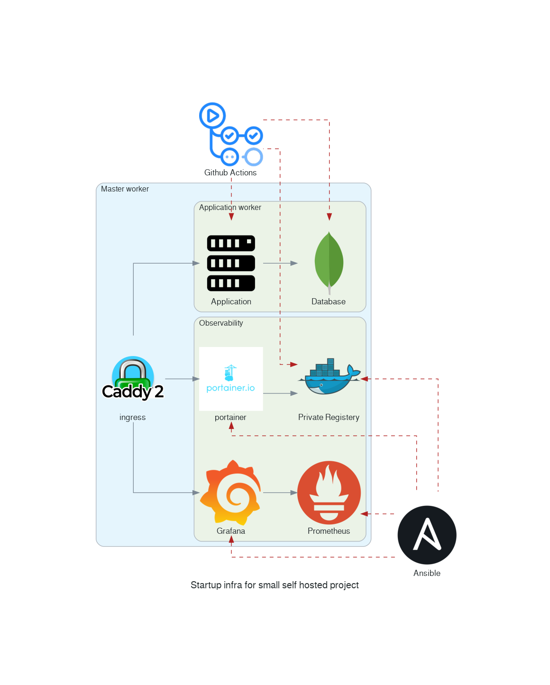
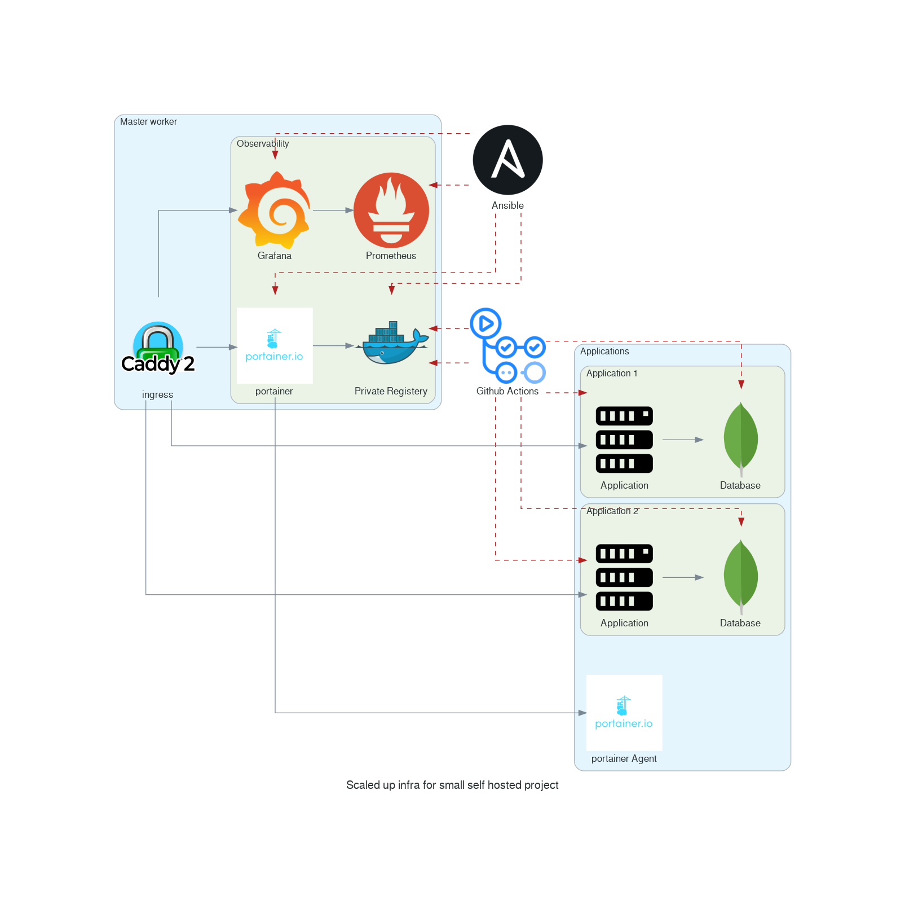

# Startup Infra for Small Self-hosted Projects

    

This repository provides Ansible playbooks to set up a minimal infrastructure for a simple self-hosted application. Ideal for small hobby projects. I made this repository a place to **Learn** about DevOps and Cloud Infrastructure. You have all the tutorial you need to get started.

Features:
* docker-swarm
* Caddy
* Portainer
* Prometheus 
* Graphana

## 🚀 Quick Start

Got your [prerequisites](./website/content/en/docs/gs1.getting_started.md#prerequisites) and [secrets configured](./website/content/en/docs/gs1.getting_started.md#configuration-secrets-management)?

Deploy your entire infrastructure with a single command:

```bash
make up
```

This command will:
*   Provision infrastructure on DigitalOcean using Terraform.
*   Install Docker on all hosts.
*   Initialize a Docker Swarm cluster.
*   Deploy Caddy and Portainer applications.

To tear down the infrastructure:

```bash
make down
```

For a detailed step-by-step guide, including prerequisites and secret management options, please refer to our **[Full Getting Started Guide](./website/content/en/docs/gs1.getting_started.md)**.

To understand the underlying Ansible concepts, check out **[Understanding Ansible Concepts](./website/content/en/docs/b1.ansible_concepts.md)**.

## Articles and Tutorials

The articles/tutorials are divided into sections. 
* **Introduction** -> What are the tools to manage infrastructure? Perfect to learn the basis.
* **How-tos** -> Good takeaway from this project - Answers many questions you could encounter in the future
* **Deepening Understanding** -> Learn more about each application used in this setup (Portainer, Graphana, Caddy, etc.)
* **Local Experimentation & Advanced Topics**: Deeper dives into specific setups and components.

I used [DigitalOcean](https://digitalocean.pxf.io/q4b2qO) for experiments because it is cheap, but any cloud provider should work, as we are mainly playing with Virtual Machines. You can even get [$200 DigitalOcean free credit](https://digitalocean.pxf.io/q4b2qO) when starting 
* Don't forget to delete everything after a tutorial if you don't want to add unnecessary costs

### Tools Introduction

* [ ] WIP: 📚 1: [What is **Terraform** and why you might need it.]()
* [X] 📚 2: [What is **Terraform Cloud** and why you might need it.](https://faun.pub/what-is-terraform-cloud-and-why-you-might-need-it-c9847fb8f6e6?sk=ee85423512f39030bb287a3f2a6623d3)
* [ ] WIP: 📚 3: [What is **Github Action** and why you might need it.]()
* [ ] WIP: 📚 4: [What is **Ansible** and why you might need it.]()
* [ ] WIP: 📚 5: [What is **Ansible AWX** and why you might need it.]()

### Learn the Tools

* [X] 🌍 [How to configure GitHub Environments with Terraform?](https://faun.pub/how-to-configure-github-environments-with-terraform-d2b76766547b?sk=b50616eed7da268d5a99c459fc9c57d5)
* [x] 🏭 [How to provision VM on Digital Ocean with Terraform?](https://faun.pub/how-to-provision-vms-on-digitalocean-with-terraform-898515a0dbbc?sk=7af174d77b4a7bd81e581378beac9a0d)
* [X] 🔏 [How to create SSH keys with Terraform?](https://faun.pub/how-to-create-ssh-keys-with-terraform-a615dfc631c1?sk=176a8f5c0c0517a01e8fabd5bb7c18fa)
* [x] 🗺️ [How to create Ansible Inventory with Terraform?](https://faun.pub/how-to-create-ansible-inventory-with-terraform-a32fcbe11be6?sk=da18fba15ee996e4c3b92782229654ee)
* [x] 👩 [How to run an Ansible playbook using GitHub Action?](https://faun.pub/how-to-run-an-ansible-playbook-using-github-action-42430dec944?sk=7796e8bd44f6b8c394b80507b8ff3e87)

### Local Experimentation & Advanced Topics

These articles cover setting up local test environments and exploring specific components in more detail. They are excellent for understanding the individual parts before or alongside deploying the full cloud infrastructure.

* [X] 🧰 1: [Design and Test Ansible playbook with Vagrant](https://faun.pub/a-disposable-local-test-environment-is-essential-for-devops-sysadmin-af97fa8f3db0?sk=f2f0e3a6b4fe4215cec13019887b6302)
   * Example code [.articles/1_vagrant_101](.articles/1_vagrant_101)   
* [X] 🧰 2 [Experimenting on Docker Swarm with Vagrant and Ansible](https://faun.pub/experimenting-on-docker-swarm-with-vagrant-and-ansible-bcc2c79ba7c4?sk=1eac227cf3c9ec5dc5abbf06f38e92c3)
   * Example code [.articles/2_docker_swarm_101](.articles/2_docker_swarm_101)
* [ ] WIP: 🧰 3: [Automate Infrastructure provisioning with Ansible and Github action]() (This might be more of an advanced topic now, focusing on CI/CD aspects beyond the basic `make up`)


### Learn about the applications used in this setup

* [ ] WIP: ☸️ 1: [What is Portainer and why you might need it.]() (Covered by [Portainer Management UI](./website/content/en/docs/a2.portainer.md))
* [ ] WIP: ☸️ 2: [What is Prometheus and why you might need it.]()
* [ ] WIP: ☸️ 3: [What is Caddy and why you might need it.]() (Covered by [Caddy Web Server](./website/content/en/docs/a1.caddy.md))

### Deep Dives

Below, I've included some explainers on how I solved a specific problem when I encountered it. This should demistify some of the magic happening in this repo.

#### Ansible

* [x] 🏃‍♂️ 1: [Speedup Ansible Playbook Pull-Requests by only running affected roles](https://medium.com/itnext/speedup-ansible-playbook-merge-request-by-only-running-affected-roles-42d9ca3f6433?sk=382b8de777e41deb20f7fefe430b2f26)
* [x] 🏃‍♂️ 2: [How to rotate Docker Secrets with Ansible](https://medium.com/itnext/rotating-docker-swarm-secrets-with-ansible-cbaddfdd8ee9?sk=886dae52f1570c251a6a664d5ee2c5fe)
* [x] 🏃‍♂️ 3: [How to implement Pull-Request locking for Ansible](https://medium.com/itnext/safe-infrastructure-as-code-github-actions-workflow-with-a-pr-lock-27bef636f852?sk=a6615ca085348aa2543a68f9c7a41077)

## Architecture



## Handy toolchain

Do you want to go fast? Too lazy to set up your local environment?

Then, use the tools from a Docker container. I included a simple Toochain in this repository and a useful alias for it.

Use common infrastructure tools in docker with:
* [docker_tools_alias.sh](bin/bash/docker_tools_alias.sh)

```
source ./bin/docker_tools_alias.sh
```

```
use dasb for ansible in docker
use dap for ansible-playbook in docker
use daws for awscli in docker
use dpk for packer in docker
use dtf for terraform in docker
use dbash for bash in docker
```

## Scale Up

With docker swarm and portainer it because easy to manager multiple nodes.


