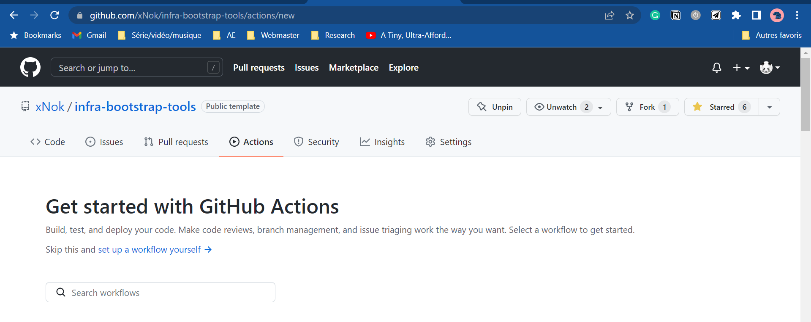
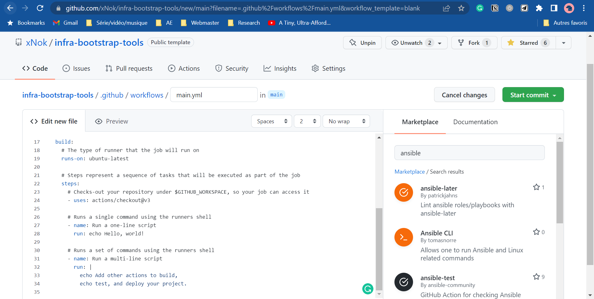
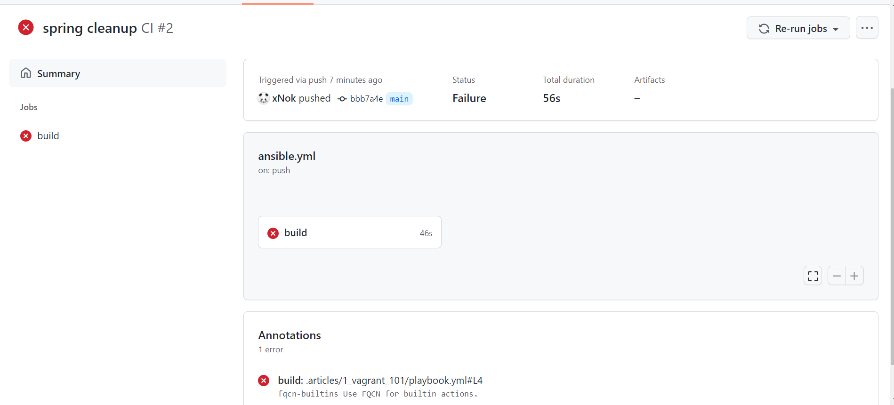
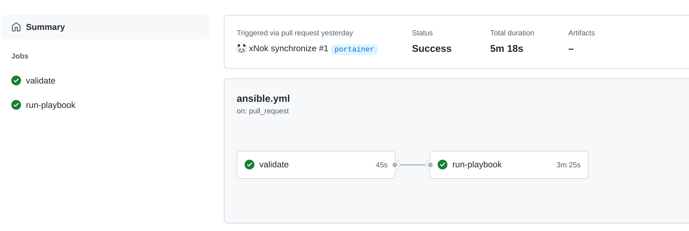

Done playing around with Ansible and configuring things from your laptop?
Let’s move to the next level and leverage Github Action to create a deployment pipeline for your playbooks. This will greatly improve your workflow and make sure all the steps you are taking are reproducible.
This tutorial aims to walk you through the steps of setting up a Github Action Workflow to validate your configuration and run your playbook against your inventory. This will allow us to set up an automated pipeline that can be triggered by a commit or pull request on GitHub with minimal overhead to manage your infrastructure.

## Quick reminders
[Ansible](https://www.ansible.com/) is a popular configuration management tool used to configure the state of your infrastructure. [Ansible Playbooks](https://docs.ansible.com/ansible/latest/user_guide/playbooks.html) are a series of tasks you would like to execute on servers to create the desired state. The playbook will typically call [modules](https://docs.ansible.com/ansible/2.9/modules/list_of_all_modules.html) which then perform one or more actions, depending on what we have defined inside them.
A [GitHub Action](https://github.com/features/actions) an automation tool built-in into Github used for triggering builds, deploying code, and automation in general. Github Action nicely interfaces with every element of Github, such as pushing commits to a branch, creating pull requests, creating issues, etc.

## Basic Ansible Playbook to get started
You may already have a playbook you wanna run automatically, but let's start small with a hello-world playbook. Create the following file and let’s call it `hello-world.yaml` in a folder called `ansible` :

```javascript
- name: This is a hello-world example
  hosts: all

  tasks:
    - name: Create a file called '/tmp/testfile.txt' with the content 'hello world'.
      copy:
        content: hello-world
        dest: /tmp/testfile.txt
        mode: 0644

```

## Configure GitHub Action to validate your Ansible code
Our playbook is ready, and we need to create the Workflow configuration.
Let’s create a new GitHub Action workflow. Go to the action tab and select [set up a workflow yourself](https://github.com/xNok/infra-bootstrap-tools/new/main?filename=.github%2Fworkflows%2Fmain.yml&workflow_template=blank).

Search in the marketplace for Ansible. This makes GitHub Action so powerful that you always have dozens of ready-to-use Actions at your fingertips.
Let's start with some linting. You want your ansible code to be the best possible before executing it into production. Select the ansible-lint module as it is the one used by Ansible Galaxy (official Ansible repository) to attribute quality scores to the role pushed there. As a result, ansible-lint is considered the default linter for Ansible.

The other advantage of Github Action is the [annotation feature](https://docs.github.com/en/actions/using-workflows/workflow-commands-for-github-actions#setting-an-error-message). Actions can very simply annotate your code in this case, you `ansible-lint`, and annotation whenever he is not happy with your code.

At this point, some initial cleanup is maybe if, like me, you have other playbooks in your projects. 
You will probably also need to fine-tune `ansible-lint` using a configuration file. You can find more about configuring `ansible-lint` [here](https://ansible-lint.readthedocs.io/en/latest/configuring/#configuration-file). For instance, I ignore the `fqcn-builtins` as it forces you to write `ansible.builtin.copy` instead of `copy` . In my opinion, the built-in function should be short and nice, so this rule concept bothers me.

```yaml

# This makes linter to ignore rules/tags listed below fully
skip_list:
  - 'fqcn-builtins'

```

Here is the GitHub Action workflow at this stage.

```yaml

# This is a basic workflow to help you get started with Actions

name: Ansible Docker Swarm

# Controls when the workflow will run
on:
  # Triggers the workflow on push or pull request events but only for the main branch
  push:
    branches: [ main ]
  pull_request:
    branches: [ main ]

  # Allows you to run this workflow manually from the Actions tab
  workflow_dispatch:

# A workflow run is made up of one or more jobs that can run sequentially or in parallel
jobs:
  # This workflow contains a single job called "validate"
  validate:
    # The type of runner that the job will run on
    runs-on: ubuntu-latest

    # Steps represent a sequence of tasks that will be executed as part of the job
    steps:
      # Checks-out your repository under $GITHUB_WORKSPACE, so your job can access it
      - uses: actions/checkout@v3

      - name: Run ansible-lint
        # replace `main` with any valid ref, or tags like `v6`
        uses: ansible-community/ansible-lint-action@v6.0.2
        with:
          args: "ansible" # my ansible files in a folder

```

> Are you done with linting? All your code is impeccable? 

## Running your playbook with GitHub Action.
Let’s go back to that [GitHub Action Marketplace](https://github.com/marketplace?type=actions) to find what you need. Unfortunately, there is no easy and flexible solution this time.
However, I want you to have that reflex to check the Marketplace first and challenge the solution. 
Ansible is a Python Application, so we need to set up a Python environment in our workflow. You will create a new job called `run-playbook` that runs after `validate` (use the `needs` property for that). 

```yaml
run-playbook:
    # The type of runner that the job will run on
    runs-on: ubuntu-latest
		# The validate Job need to be sucessfull
		needs: [ validate ]

    steps:
      # Checks-out your repository under $GITHUB_WORKSPACE, so your job can access it
      - uses: actions/checkout@v3

      - name: Set up Python 3.9
        uses: actions/setup-python@v2
        with:
          python-version: 3.9

      - name: Install dependencies Including Ansible
        run: |
          python -m pip install --upgrade pip
          if [ -f requirements.txt ]; then pip install -r requirements.txt; fi
          if [ -f test-requirements.txt ]; then pip install -r test-requirements.txt; fi

```

Setting up a Python environment is pretty standard, your are going to use `requirements.txt` to lest all the dependences you need including Ansible:

```yaml
ansible==2.10.7
ansible-lint==6.0.2
jsondiff==2.0.0
passlib==1.7.4
PyYAML==6.0

```

Then you need an inventory file for Ansible. Inventory is sensitive information, so I used secrets to store my inventory file. All is left, is writing the value of the secret to a file and Ansible will be able to read from it.

```javascript
    - name: write inventory to file
        env:
          INVENTORY: ${{ secrets.INVENTORY }}
        run: 'echo "$INVENTORY" > inventory'

```

Next, to communicate to your servers, you need SSH key pairs. The best way to manage SSH key is via this `ssh-agent` . Lucky for us, there is an action to do just that. All values here are sensitive so they are stored in secrets.

```javascript
- name: Install SSH key
        uses: shimataro/ssh-key-action@v2
        with:
          key: ${{ secrets.SSH_KEY }}
          name: id_rsa # optional
          known_hosts: ${{ secrets.KNOWN_HOSTS }}
          # config: ${{ secrets.CONFIG }} # ssh_config; optional
          if_key_exists: fail # replace / ignore / fail; optional (defaults to fail)

```

Last by not least running your playbook. This step is as simple as running the `ansible-playbook` command with your inventory file as a parameter.

```javascript
- name: run playbook
        run: |
          ansible-playbook -i inventory ansible/hello-world.yaml

```

The only thing left to do is running the pipeline


## What to do next?
Running an hello-wold playbook is fun by how about deploying an complete infrastructure and automatically provision the infrastructure with Terraform? If you are tempted by the adventure here is a learning path for you
1.  **Provision VMs on Digital Ocean with Terraform?**
You need server to work with so learn how to provision them as code. I chose Digital Ocean because it is in my opinion the most beginner friendly out there.
1. **Create Ansible Inventory with Terraform?**
You don’t want to manually create the inventory and define a secret in GitHub Action as we did in this tutorial, This is an unnecessary step so let’s automate it.
1. **Create SSH keys with Terraform?**
How about you also create `KNOWN_HOSTS` , `SSH_KEY`  directly with Terraform so you never have configure anything in GitHub UI.
1. **Configure GitHub Environments with Terraform?**
Let’s push the configuration of you GitHub once step further using Terraform so that everything ion you pipeline is define as code including permissions.
