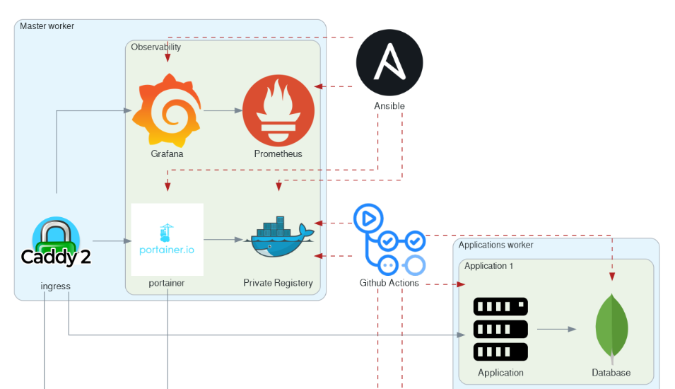

I recently returned to one of the self-hosted projects I deployed using Ansible and Github Action. After making some configuration changes, I opened a pull request and let the pipeline run to apply those changes.

So far, everything has been expected, but I **got frustrated** that I had to make a way for Ansible to apply all defined roles, even if nothing had changed. 🕐 My project is relatively small, and it might be a pain for anyone using Ansible to **apply atomic changes without running the entire play**.

Deploying all roles regardless of changes is inefficient and makes it quite frustrating 💢 to iterate and develop new features. So, I dug into the problem and devised a nice solution. 👼

This tutorial aims to walk you through the steps of implementing a feature I called `affected_roles`, which enables **conditional role deployment based on changes detected in a pull request**.



## Problem Statement

I am making a few assumptions so that it applies nicely to my workflow. I am running an Ansible playbook using GitHub Action and the deployment feature. This means that when I open a pull request, the playbook is validated and paused for the deployment to be manually approved.

I assume that the **environment is already up** and in sync with the master; if not, I should run my workflow on the master. Pull-request should only be used to make atomic changes; thus, there is a need to apply only affected roles.

Once a pull request is merged, the workflow runs again, but this time, I expect the entire playbook to run for the sake of sanity.

So far, those are the requirements! You can find the project in question on GitHub here:
[GitHub - xNok/infra-bootstrap-tools](https://github.com/xNok/infra-bootstrap-tools)

We need to create a role `affected_roles` that is expected to run on localhost (either locally on my laptop or in the GitHub Action Runner executing the play). This role `set_facts` about which roles are affected (deduced from `git diff`), which allows us to define a `when` condition on each role we want to run conditionally.

Let’s dig in!

## Detecting affected Roles

Here's a small recap: Ansible roles are a way to organize playbooks and manage tasks in a structured manner, making it easier to reuse and share automation code. Roles are a collection of related tasks organized into folders (the roles are named after the folder, as a matter of fact). Thus, this role is affected if files are changed in a role folder.

### Registering the Current Branch

First, we need to identify the **current branch** in the playbook. This is important because we want to know if we are running on the `main` branch. All roles would have to be played if we ran on the main branch.

```yaml
- name: Register current branch
  ansible.builtin.shell: git rev-parse --abbrev-ref HEAD
  register: branch

- debug: 
    msg: "{{ branch.stdout }}"

```

The issue with the code above is that GitHub Action runs on **a detached head**. This works fine locally, but we need to make some adjustments for CI/CD jobs. Most CI/CD allow access to the current branch associated with a Pull Request. Thus, we will assume we have set the variable `BRANCH_NAME` in the CI. That way, the task will be CI/CD agnostic.

```yaml
- name: Register current branch
  ansible.builtin.shell: |
    if [ -z "$BRANCH_NAME" ]; then
      BRANCH_NAME=$(git rev-parse --abbrev-ref HEAD)
    fi
    echo $BRANCH_NAME
  register: branch

```

Here is how we set the `BRANCH_NAME` variable in GitHub Action:

```yaml
- name: run playbook
  run: |
    ansible-playbook -i inventory ansible/docker-swarm-portainer-caddy.yml
  env:
    BRANCH_NAME: ${{ github.head_ref }}

```

### Detecting Changes Using Git Diff

Next, we’ll use `git diff` to identify the files that have changed between the main and current branches.

```yaml
- name: Register the git diff
  ansible.builtin.shell: git diff --name-only origin/main..origin/{{ branch.stdout }} .
  register: diff

- debug: 
    msg: "{{ diff.stdout_lines }}"

```

We have to tell git diff that we want to make the diff against the `origin` because GitHub Action is doing a Shallow clone for both references `main` and `{{ branch.stdout }}` are not available and thus would trigger errors in the CI.

### Extracting Affected Folders

We then extract the folders from the diff output to identify which directories contain changes. This is where the magic starts to happen. We have to `regex` out the folder because `git diff` provided us with a list of files.

```yaml
- name: Extract folders from the diff
  set_fact:
    changed_folders: "{{ diff.stdout_lines | map('regex_replace', '^(.*/).*$' , '\\1') | unique }}"

```

The `regex_replace` and `unique` filters help us get a list of unique folders that have been modified.

### Filtering Folders Within the Roles Directory

We filter out the folders within the roles directory to focus on the roles that have changed. It is probably possible to merge this with the previous task and finish it in one shot. However, getting the filter right was much more accessible by splitting the task into two parts.

```yaml
- name: Filter folders within the roles directory
  set_fact:
    roles_with_changes: "{{ changed_folders | select('match', '^' + roles_folder + '/') | map('regex_replace', '^' + roles_folder + '/([^/]+)/.*$', '\\1') | unique }}"
  when: branch.stdout != default_branch

```

This step ensures that we only consider the modified roles. Here you go—those are all the tasks we need!

## Using the `affected_roles` Role in the Main Playbook

We encapsulate the logic for determining affected roles in a dedicated Ansible role named `affected_roles`. Let’s assume we have the following folder structure:

```text
roles/
  affected_roles/
    tasks/
      main.yml
  role1/
  role2/
  role3/

```

You can find the completed code here in the repository under `ansible/roles/utils-affected-roles/tasks/main.yaml`.

Now, we can integrate the `affected_roles` role into the main playbook to include other roles based on conditional changes. After executing our role on localhost, we can look at `hostvars['localhost']['roles_with_changes']` variables to know if the role has been affected and if we need to execute it. Here is an example:

```yaml
- name: Determine affected roles
  hosts: localhost
  gather_facts: no
  roles:
    - affected_roles

- name: Conditionally run roles based on changes
  hosts: all
  gather_facts: no
  tasks:
    - name: Include role_1 if it has changes
      include_role:
        name: role_1
      when: "'role_1' in hostvars['localhost']['roles_with_changes']"

    - name: Include role_2 if it has changes
      include_role:
        name: role_2
      when: "'role_2' in hostvars['localhost']['roles_with_changes']"

    - name: Include role_3 if it has changes
      include_role:
        name: role_3
      when: "'role_3' in hostvars['localhost']['roles_with_changes']"

```

This main playbook runs the `affected_roles` role to determine the roles with changes and then conditionally include other roles (`role_1`, `role_2`, and `role_3`) based on the `roles_with_changes` variable.

## Conclusion

The `affected_roles` feature significantly improves the efficiency of my Ansible playbook deployments by ensuring that only the roles affected by changes in a pull request are deployed.
