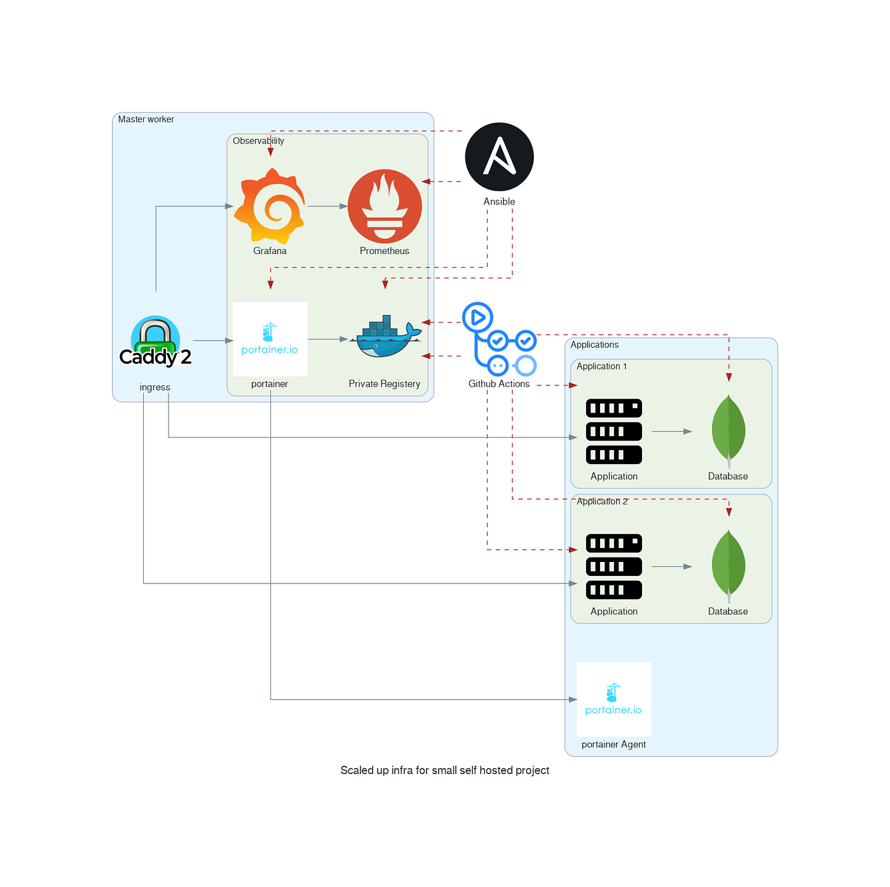

You're reading for free via [Alexandre Couëdelo's](https://alexandre-couedelo.medium.com/?source=post_page-----af97fa8f3db0---------------------------------------) Friend Link. [Become a member](https://medium.com/m/signin?operation=register&redirect=https%3A%2F%2Ffaun.pub%2Fa-disposable-local-test-environment-is-essential-for-devops-sysadmin-af97fa8f3db0&source=-----af97fa8f3db0---------------------post_friend_link_meter------------------) to access the best of Medium.

# A Disposable Local Test Environment is Essential for DevOps / SysAdmin

## Design and Test Ansible playbook with Vagrant

Photo by [Ben White](https://unsplash.com/@benwhitephotography?utm_source=medium&utm_medium=referral) on [Unsplash](https://unsplash.com/?utm_source=medium&utm_medium=referral)

Working on your infrastructure setups and testing your automation script can be tedious if you don’t have a proper test environment that enables a fast iteration loop. The best when automating your server provisioning with [Ansible ](https://www.ansible.com/)scripts is to be able to set up servers a local server step by step then play all the steps from the ground up and make sure everything goes as planned. Once the local and iterative design phase is complete you will be ready to create an automated pipeline to set up an actual production environment.

Why Ansible you may ask? Ansible is simple and easy to learn if you have some Linux administration knowledge. We are configuring a Linux server after all you can’t escape that part.

With a small project spread across several articles, I want to show you what I consider the minimum requirement for a small self-hosted project. I invite you to check my [Github repository](https://github.com/xNok/infra-bootstrap-tools) for other articles and more details about the whole project.

In this article, you will see how to get started and set up a local testing environment. You will learn about [Vagrant ](https://www.vagrantup.com/)a tool to create local virtual machines on the fly.

## Getting Started with Vagrant

First, install Vagrant. Simply go to the [main page](https://www.vagrantup.com/) and download the product for your platform. Once Vagrant is installed you can need a hypervisor, the most popular is VirtualBox because it can run on Linux, Windows, and Mac OS. With both requirements installed (Vagrant + VirtualBox) you can get started spawning a Linux Debian** **virtual machine and start experimenting.

To create a VM, you need to understand the Concept of a [Vagrant Box](https://www.vagrantup.com/docs/boxes). Put simply Boxes is the way Vagrant packages environments so they can be shared via a registry such as [Vagrant Cloud](https://app.vagrantup.com/boxes/search). Let’s search for a Debian box that fit your need. This one should do the job: [generic/debian10](https://app.vagrantup.com/generic/boxes/debian10)

Two steps to getting your box running:

```text
vagrant init generic/debian10
vagrant up

```

The first command created a file called [Vagrantfile](https://www.vagrantup.com/docs/vagrantfile) that describes how to provision your environment. The file created with the `init` command simply specifies that we want to use the Vagrant box [**generic/debian10**](https://app.vagrantup.com/generic/boxes/debian10) as a base.


The second command `vagrant up` starts and provision the VM. Once your box is running you can SSH into and play with it.

```text
vagrant ssh

```

At that point, you could start making procedures about how to install everything you need. But this approach would not be to be maintainable and reproducible. This is why you need to also learn about Vagrant [provisioner](https://www.vagrantup.com/docs/provisioning)s.

## Vagrant and Ansible

[Ansible](https://github.com/ansible/ansible) is a simple automation tool that can orchestrate pretty much any task you would need to configure and maintain your infrastructure. Ansible work best when you are dealing with actual machines (servers or virtual machines), I would not recommend using it to provision Cloud infrastructure as it lacks state management capabilities you can find in other tools such as [Terraform](https://www.terraform.io/). But here we will be dealing with configuring Linux servers so ansible works best here.

In order to make the bridge between Vagrant and Ansible, you will use the [Ansible *Provisioners*](https://www.vagrantup.com/docs/provisioning/ansible_common)*. *Provisioners are tools that vagrant will use to set up your virtual machine and Vagrant support the most command tools on the market and offers the ability to create your own provisioner to meet your needs. But let’s focus on the [Ansible Local Provisioner](https://www.vagrantup.com/docs/provisioning/ansible_local), that way you don’t even have to worry about installing Ansible on your local machine Vagrant will install it inside your virtual machine.


Vagrant makes it easy for you to run your ansible provisioning scripts against the virtual machine is created for you. You should see a folder `.vagrant` at the root of your project (this folder should be ignored by git, if not add it to your `.gitignore`).

Next, you need to create a “hello-world” playbook called `playbook.yaml`:


You are ready to try out your first ansible provisioning with Vagrant

```text
$ Vagrant up
Bringing machine 'default' up with 'virtualbox' provider...
==> default: Checking if box 'generic/debian10' version '3.6.8' is up to date...
==> default: Clearing any previously set forwarded ports...
==> default: Fixed port collision for 22 => 2222. Now on port 2200.
==> default: Clearing any previously set network interfaces...
==> default: Preparing network interfaces based on configuration...
    default: Adapter 1: nat
==> default: Forwarding ports...
    default: 22 (guest) => 2200 (host) (adapter 1)
==> default: Running 'pre-boot' VM customizations...
==> default: Booting VM...
==> default: Waiting for machine to boot. This may take a few minutes...
    default: SSH address: 127.0.0.1:2200
    default: SSH username: vagrant
    default: SSH auth method: private key
==> default: Machine booted and ready!
==> default: Checking for guest additions in VM...
==> default: Mounting shared folders...
    default: /vagrant => E:/Nokwebspace/infra-bootstrap-tools
==> default: Running provisioner: ansible_local...
    default: Installing Ansible...
    default: Running ansible-playbook...PLAY [This is a hello-world example] *******************************************TASK [Gathering Facts] *********************************************************
ok: [default]TASK [Create a file called '/tmp/testfile.txt' with the content 'hello world'.] ***
changed: [default]PLAY RECAP *********************************************************************
default                    : ok=2    changed=1    unreachable=0    failed=0

```

If you make changes to the playbook you can simply run only the provisioning stage

```text
vagrant provision

```

Once you are done or want to take a break simply stop the VM.

```text
vagrant halt

```

## Conclusion

You are ready to start working on your next infrastructure provisioning project. Having a disposable test environment is essential and Vagrant will soon become your favorite tool.

If you want to learn more the logical follow-up article would be:
[

## Experiment with Vagrant and Ansible — Docker Swarm for Small Self-hosted Projects

### A Disposable Local Test Environment for DevOps / SysAdmin

faun.pub
](https://faun.pub/experimenting-on-docker-swarm-with-vagrant-and-ansible-bcc2c79ba7c4?source=post_page-----af97fa8f3db0---------------------------------------)
You can also check my Github repository [https://github.com/xNok/infra-bootstrap-tools](https://github.com/xNok/infra-bootstrap-tools) to find more tutorials and build the following infrastructure.


Infrastructure for small self-hosted project

[

](https://faun.to/bP1m5)

Join FAUN: [**Website**](https://faun.to/i9Pt9)** **💻**|**[**Podcast**](https://faun.dev/podcast)** **🎙️**|**[**Twitter**](https://twitter.com/joinfaun)** **🐦**|**[**Facebook**](https://www.facebook.com/faun.dev/)** **👥**|**[**Instagram**](https://instagram.com/fauncommunity/)** **📷|[**Facebook Group**](https://www.facebook.com/groups/364904580892967/)** **🗣️**|**[**Linkedin Group**](https://www.linkedin.com/company/faundev)** **💬**|** [**Slack**](https://faun.dev/chat) 📱**|**[**Cloud Native** **News**](https://thechief.io/)** **📰**|**[**More**](https://linktr.ee/faun.dev/)**.**
