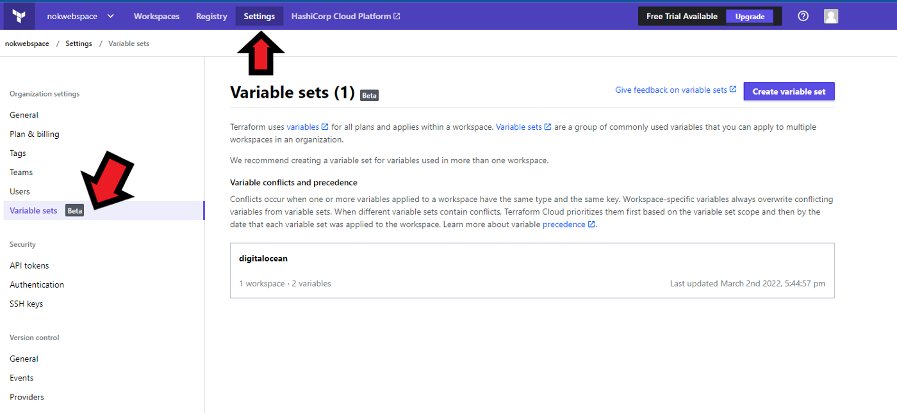
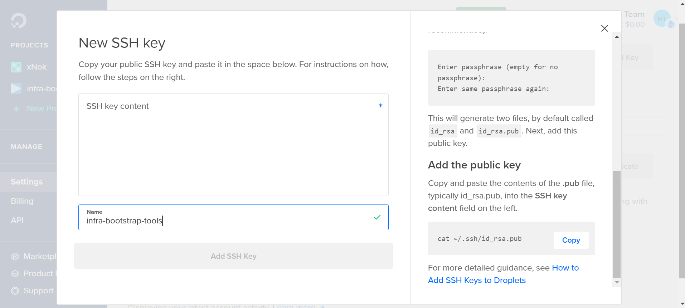

Terraform is now the most popular tool to build and manage infrastructure in an organized way. While it is tempting to jump to DigitalOcean UI and create whatever you need. Using Terraform will make your project much more maintainable and even save you money as you can destroy and recreate everything with the click of a button.
In this article, we'll go through provisioning VM on DigitalOcean using terraform scripts.

## Provisioning the droplet with Terraform
We will start with the basics this is what every terraform project needs

- **backend.tf**: Where do you want to terraform the state
- **version.tf**: List all the provider’s versions you are using in your project
- **main.tf**: This is your actual terraform script/configuration starts
- **variables.tf**: this is where you are going to define the variables you need
- **env.tfvars**: these are the actual variables for the dev environment
let’s get started with each of these files on by one.

### **backend.tf**
I will be using terraform cloud because it is a free remote backend option as well as an amazing UI to manage in a tailor-made interface your terraform plans and apply. Here the the remote backend definition:

```hcl
terraform {
  backend "remote" {
    hostname = "app.terraform.io"
    organization = "nokwebspace"

    workspaces {
      name = "infra-bootstrap-tools-digitalocean"
    }
  }
}

```

Creating a workspace is very easy, you only need a git repository and a couple clicks in the UI.


Now you need to log in your Terraform cloud using an API key

```bash
terraform login

```

Here is how to find your token:


### **versions.tf**
This file is used to tell Terraform what version of the provider you wanna use.

```hcl
terraform {
  required_providers {
    digitalocean = {
      source = "digitalocean/digitalocean"
      version = "2.17.1"
    }
  }
}

provider "digitalocean" {
  # Configuration options
  # We use the env variable DIGITALOCEAN_ACCESS_TOKEN
}

```

You need to add the DigitalOcean token to Terraform Cloud. If you chose not to use Terraform Cloud don’t forget to export the token to your console

```bash
export DIGITALOCEAN_ACCESS_TOKEN=

```

Below is how you can add the variable to Terraform Cloud. I used variable set as you can reuse the variable in multiple workspace which is very handy.


### **main.tf**
Now you are going to start writing some Terraform code. Your goal is to create one or more droplets for your project. On top of the droplet, we need to fetch a reference to an [SSH key registered in DigitalOcean](https://docs.digitalocean.com/products/droplets/how-to/add-ssh-keys/). 

Plus you want to keep everything organized so let's create a project and add every created droplet to that project. Here is the code:

```hcl
/**
 * # DigitalOcean Project
 *
 * Projects let you organize your DigitalOcean resources 
 * (like Droplets, Spaces, and load balancers) into groups.
 */
resource "digitalocean_project" "infra-bootstrap-tools" {
  name        = "infra-bootstrap-tools"
  description = "Startup infra for small self-hosted project"
  purpose     = "IoT"
  environment = "Development"
  resources = digitalocean_droplet.node.*.urn
}

/**
 * This SSH key regietere via the UI
 */
data "digitalocean_ssh_key" "test" {
  name = "test"
}

/**
 * Create one or more droplets
 */
resource "digitalocean_droplet" "node" {
  count = var.worker_count

  image  = "ubuntu-20-04-x64"
  name   = "node${count.index}"
  region = "lon1"
  size   = "s-1vcpu-1gb"

  ssh_keys = [data.digitalocean_ssh_key.test.id]
}

/**
 * Useful to log in to the VM later
 */
output "nodes_ip" {
  value = digitalocean_droplet.node.*.ipv4_address
}

```

### [**variables.tf**](http://variables.tf)
We are using those variables to make the Terraform scripts configurable. For instance, we want to define how many instances we need.

```hcl
variable "worker_count" {
  type = number
  default = 1
}

```

You set a default value so you don’t really need to pass variable files for this example.

### All done you are good to go
Run the plan 👶

```bash
terraform plan

```

If everything looks good go and apply 😄

```bash
terraform apply

```

## What to do Next?
Creating VM is like the baby steps of cloud engineering there are so many opportunities after that. 
I created this tutorial to be part of a set of Q&A series where the goal is to help you build your next Cloud project. Here are the Question I already answered:

- 🌍 How to configure GitHub Environments with Terraform?

- 🏭 How to provision VM on digitalocean with Terraform?

- 🔏 How to create SSH keys with Terraform?

- 👩‍🍳 How to run an Ansible playbook using GitHub Action?

You can find more code and knowledge in the dedicated Github repository


## References
[https://learn.hashicorp.com/tutorials/terraform/digitalocean-provider?in=terraform/applications](https://learn.hashicorp.com/tutorials/terraform/digitalocean-provider?in=terraform/applications)
