[**Terraform Cloud**](https://cloud.hashicorp.com/products/terraform)** **is the managed solution offered by [**Hashicorp**](https://www.hashicorp.com/) to run **Terraform **configurations 💡. It is in some manner a “CI/CD tool” to manage Infrastructure as Code (IaC). It eliminates the need for you to configure a dedicated task in your CI/CD (Jenkins, Bamboo, Circle CI, etc.) and also provided a tailor-made UI, remote state management, and private module registry.
While it is always possible to use terraform as a CLI in any CI/CD this always comes with frustration when it comes to creating the perfect workflow to plan and apply changes to your infrastructure. If you work a lot with those tools Terraform and Ansible you will realize that dedicated tools add a lot of value.
Terraform Cloud is I deal if you are working on your personal project as it is Free. I also like to use it as it offers a central UI for all your project and a [state-management](https://www.terraform.io/language/state/remote). Otherwise, you have to create a resource with your cloud provider to manage your state S3 for AWS, Cloud Storage for GCP, Blob Storage for Azure. I believe you won’t find the same effortless management of Terraform scripts with another provider so Terraform Cloud is the best place to get started with Terraform.
In this article, I will give you a tour of Terraform Cloud and the necessary explanations to get started. This piece is part of a series I created on How to create infrastructure for a small self-hosted project. You can find all the code here: [https://github.com/xNok/infra-bootstrap-tools](https://github.com/xNok/infra-bootstrap-tools), but this article does not how much prior requirements if it is not being a little bit familiar with Terraform.
# Register on Terraform Cloud.
Simple task! Just go to [https://cloud.hashicorp.com/products/terraform](https://cloud.hashicorp.com/products/terraform) and click on `Try cloud for free` , complete the form, validate your email and let's meet at the next step.
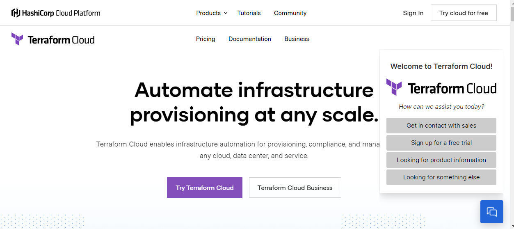
## Create a Workspace in Terraform Cloud.
Once you registered it is time to create your first workspace. [Terraform workspace](https://www.terraform.io/language/state/workspaces) is a feature design to manage `environments` (aka. different setup using the same underlying terraform logic). For instance, you could have a workspace `dev` and a workspace `prod`. However, you can use workspaces how you’d like. Here is how to create a workspace. 
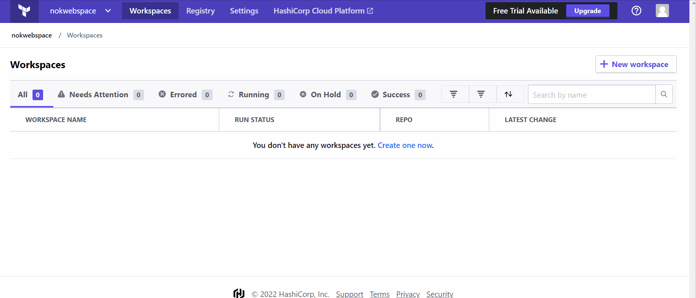

Here are the steps:
- Click on `create a new workspace`
- Name your workspace (choose a naming convention to keep things in order)
- (Optional) define the `Terraform working directory` this is the folder holding the [main.tf](http://main.tf) you wish to execute.
- Create the workspace
Terraform Cloud free remote backend option is a game changer. You can configure as follow:
```python
terraform {
  backend "remote" {
    hostname = "app.terraform.io"
    organization = "nokwebspace"

    workspaces {
      name = "infra-bootstrap-tools-digitalocean"
    }
  }
}
```
It is considered best practice to place the remote backend configuration in a file called `backend.tf`
Now you need to log in to your Terraform cloud using an API key. First, run the command and follow the instruction from the prompt.
```python
terraform login
```
Then create an API key using the UI. The small GIF below will show you how.
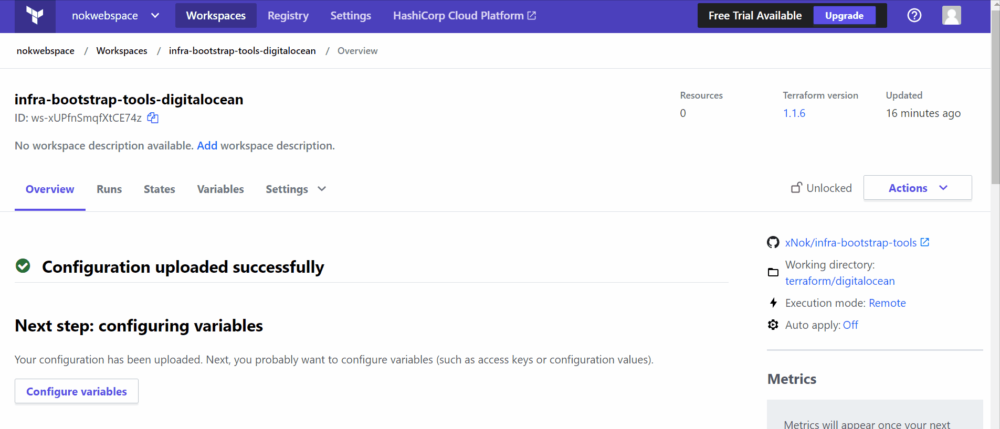
## Create a small example
I was working on [DigitalOcean](https://www.digitalocean.com/) for my [https://github.com/xNok/infra-bootstrap-tools](https://github.com/xNok/infra-bootstrap-tools) tutorials, so this example uses digital Ocean Terraform provider, but do not worry nothing fancy at all simple create a “project” (some kinda folder for resources).
Like in any terraform project after creating the [`backend.tf`](http://backend.tf) I create a [`versions.tf`](http://versions.tf) to configure my provider
### **versions.tf**
Simple this configuration comes straight from the provider documentation: 💪
```python
terraform {
  required_providers {
    digitalocean = {
      source = "digitalocean/digitalocean"
      version = "2.17.1"
    }
  }
}

provider "digitalocean" {
  # Configuration options
  # will use DIGITALOCEAN_ACCESS_TOKEN env variable
}
```
 [`backend.tf`](http://backend.tf) done ☑️, [`versions.tf`](http://versions.tf) done ✅, next `main.tf`
### **main.tf**
Now you are going to start writing some terraform code. Nothing difficult and this cost nothing, just a test.
```python
/**
 * # DigitalOcean Project
 *
 * Projects let you organize your DigitalOcean resources 
 * (like Droplets, Spaces, and load balancers) into groups.
 */
resource "digitalocean_project" "infra-bootstrap-tools" {
  name        = "infra-bootstrap-tools"
  description = "Startup infra for small self-hosted project"
  purpose     = "IoT"
  environment = "Development"
}
```
### Validating the Script locally 

```python
terraform plan
```
Note when running this script locally you will need to set `DIGITALOCEAN_ACCESS_TOKEN` with your DigitalOcean API key
## Provisioning the infra with Terraform Cloud
This is where the show starts 🎇. The last setup required is to set `DIGITALOCEAN_ACCESS_TOKEN` in terraform cloud. Terraform Cloud recently added the notion of [variable set ](https://learn.hashicorp.com/tutorials/terraform/cloud-multiple-variable-sets?in=terraform/cloud)that I found amazing to manage account API credentials. With a** *variable set,* **I can define all my DigitalOcean related variable (API key, organization name, admin email, etc.)
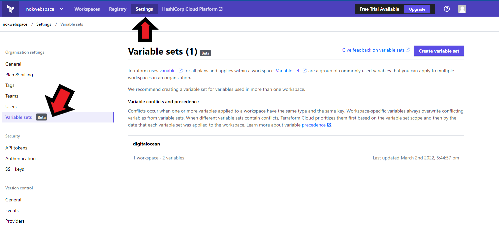

Once you have set your credentials simply commit and push your code to GitHub. If you go back to `workspaces` you see the status updated to planned.

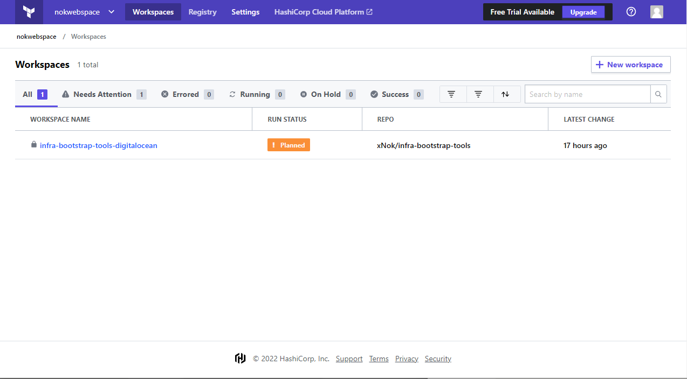

Next, inspect your workspace, look at the UI. You will notice that each resource gets a separate view to give you the time to carefully inspect your plan.

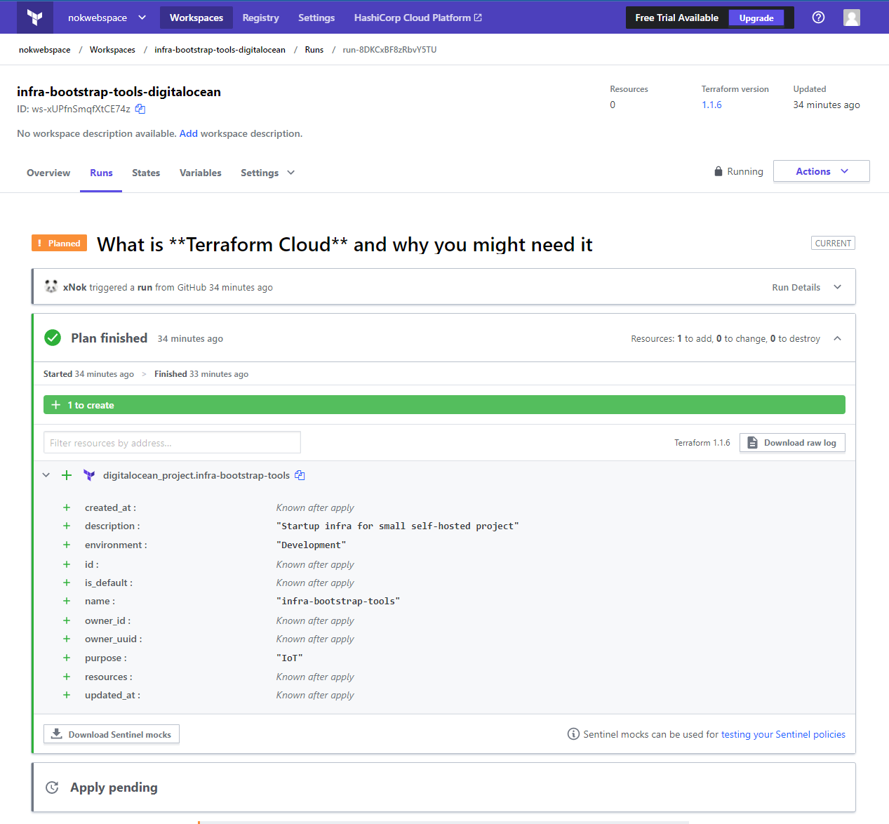
Your review is done you can go ahead and hit `confirm and Push` .
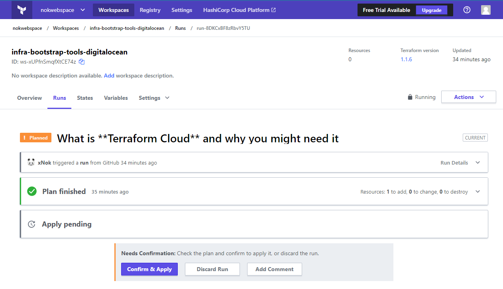
There you go new resource created with Terraform Cloud.
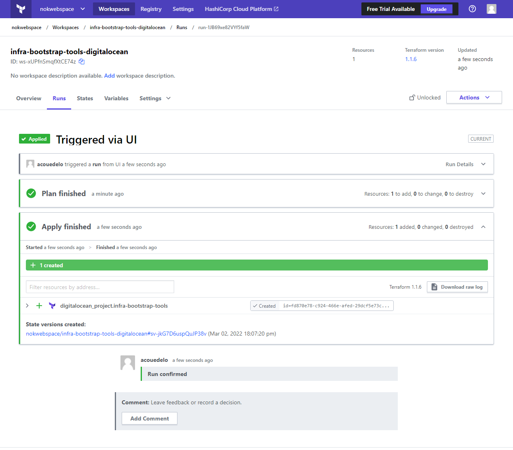
## What you should do next?
Explore the added feature of Terraform Cloud
- Done working for the day on your project? Launch a destroy plan.
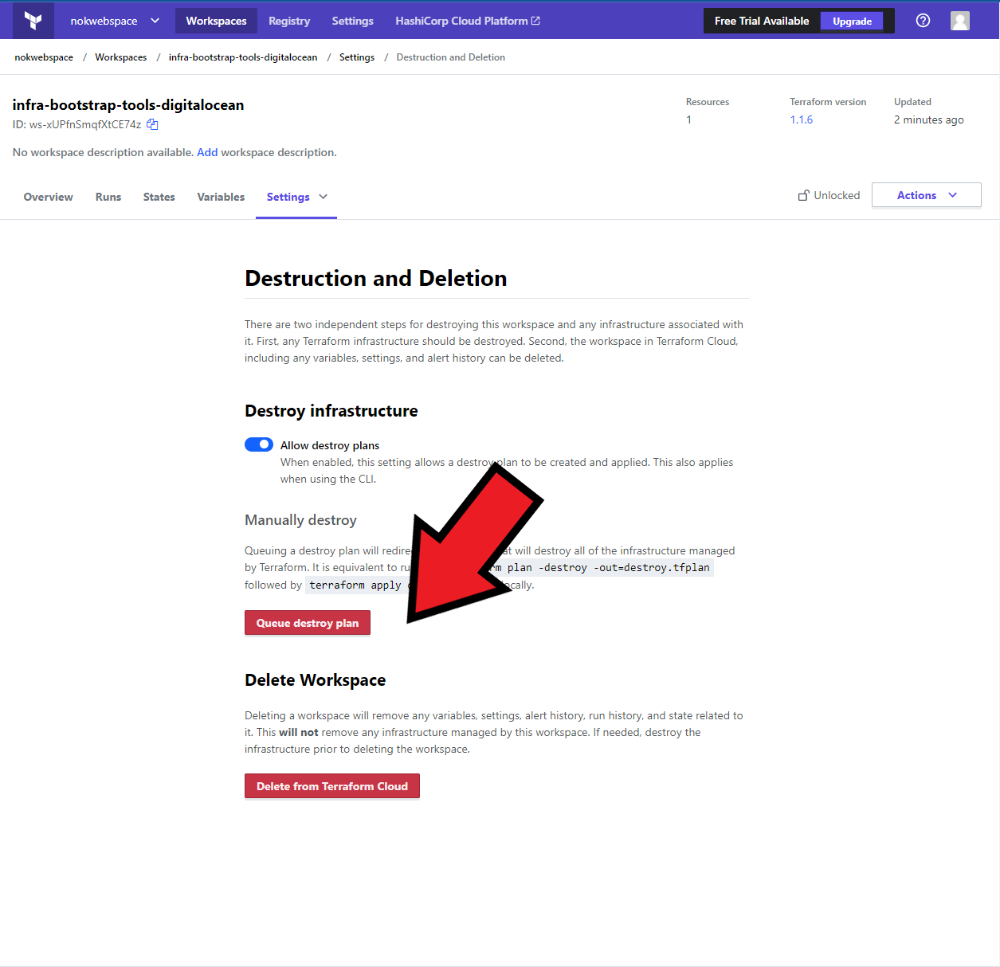

- Add notifications to your Slack Channels
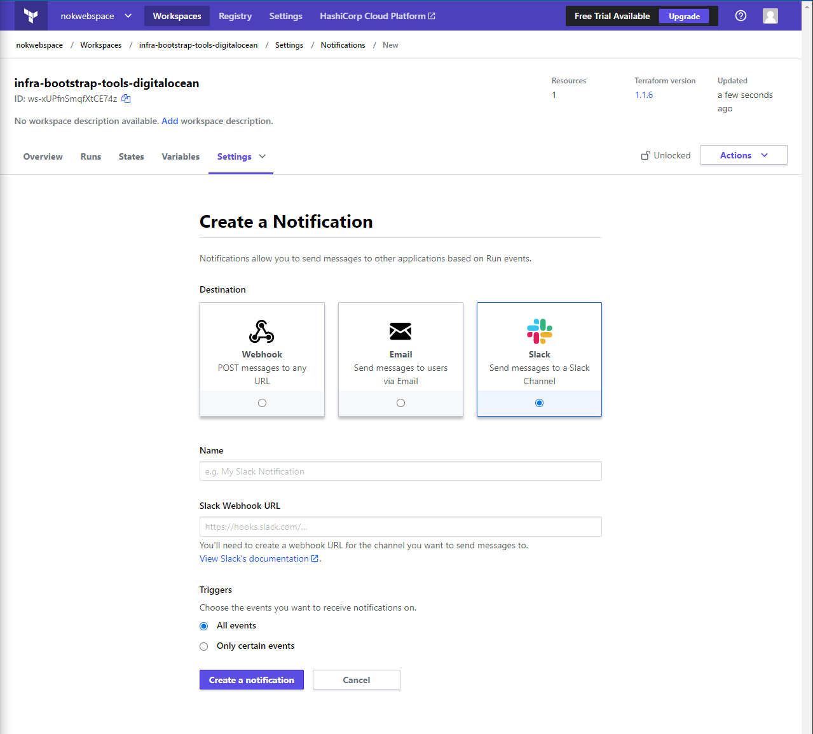
- Complex workflow with **Run Triggers**
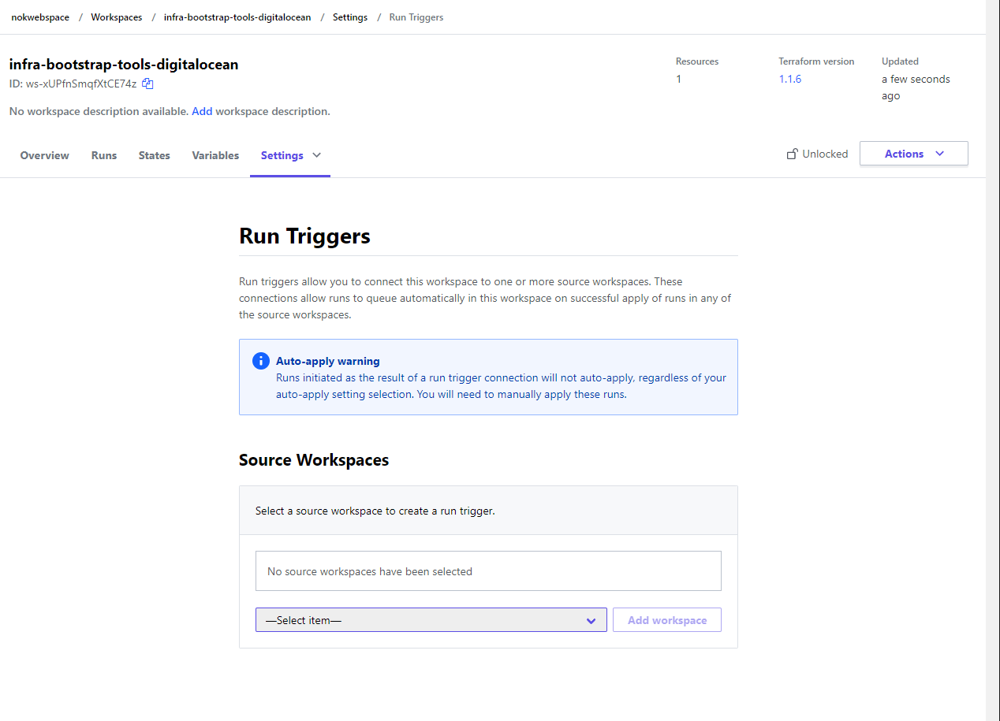
- Run plan on pull-requests
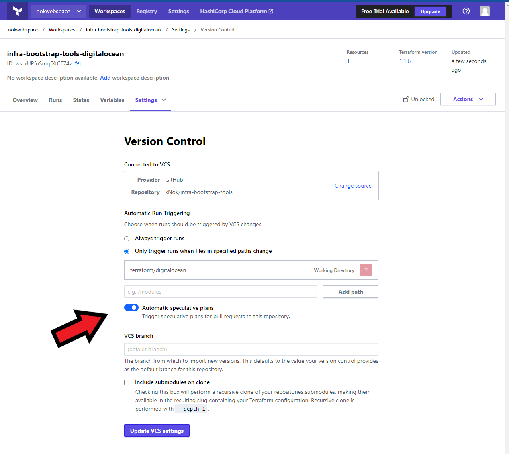
## Conclusion
The Free offering of Terraform Cloud offers all you need for an open-source project (remote state and plan/apply workflow) so I don’t see any reason not to take advantage of this opportunity 😇.
For corporate usage is a very good product made by the creators of Terraform. If don’t have anything better already then just hop on.
I will use Terraform Cloud in my personal projects. I am building this repository [https://github.com/xNok/infra-bootstrap-tools](https://github.com/xNok/infra-bootstrap-tools) to demonstrate how to build a minimal (but scalable) infrastructure for a simple self-hosted application. I am sharing the setup I have been using for over many years and writing articles about all the DevOps-related knowledge. So have a look and follow along 🤟.

