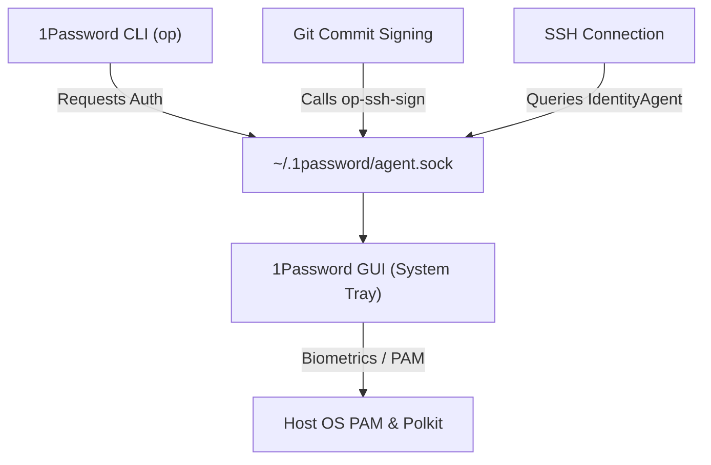

# My Personal Nix Configuration: Discoveries and Learnings

In [The Holy Grail of Development Environments](/blog/journey-to-nix/), I mapped my transition to Nix through several distinct phases:
1. **The Docker Era**: Containerizing CLI tools (reproducible but slow and bloated).
2. **The Bash Era (`ibt`)**: Custom scripts dispatching host setup (hard to maintain).
3. **The Nix Discovery (`shell.nix`)**: Declaring robust, local project environments.
4. **Going Deep with `home-manager`**: Codifying my global user profile and desktop settings.

But here is the catch: when I wrote about *Phase 4* (Home Manager) in that previous article, it read like a smooth, effortless victory. I showed the elegant Nix code blocks and clean configurations. 

What I omitted were the "downs"—the hours spent debugging directory permissions, tracing Nix store symlinks, troubleshooting Chromium sandboxes, and pairing with AI to figure out why my Ubuntu desktop environment refused to load my Nix-installed apps or accept biometrics for Git signing. 

Running Home Manager on top of a generic Linux host (Ubuntu) instead of a pure NixOS system means you are straddling two different worlds. Rather than just showing a finished config, this follow-up is the real, unvarnished story of those hurdles, the debugging loops, and the exact solutions that resolved them.

---

## Starting Small: Package Declarations & Boundaries

When transitioning from standard system packages (`apt install`), the first step is declaring your tools in `home.packages` inside your `home.nix`:

```nix
home.packages = [
  pkgs.git
  pkgs.gh
  pkgs.zsh
  pkgs.vscode
  pkgs.docker
  pkgs.nodejs_22
  pkgs.uv
  pkgs.just
];
```

### The Boundary: Global vs. Project-Level Packages

A core design decision when adopting Nix is deciding what lives in your global `home-manager` profile versus what belongs in project-level `shell.nix` or `flake.nix` configurations managed by `direnv`. 

For CLI and permanent shell tooling, Home Manager works incredibly well. My package list is divided into two categories:

1. **The Obvious Globals**: Tools like `git`, `gh` CLI, `zsh`, and the `docker` client are fundamental pieces of infrastructure. They form the core developer environment and are expected to be available instantly in every single terminal session.
2. **The Utility Globals (Why they are here)**:
   - **`uv` and `just`**: While we use project-level virtualenvs, having Python runners like `uv` and task runners like `just` installed globally is highly practical. It ensures I can run isolated Python scripts or dispatch project-level command tasks (`just test`, `just build`) from any directory on my machine without first entering a specialized project shell.
   - **`nodejs_22`**: Node.js is a dependency for various background services, formatting utilities, and editor plugins (like VS Code extensions). Keeping a stable LTS version in my global user profile ensures these auxiliary applications run smoothly out of the box.

---

### Finding the Right Nix Packages

One challenge beginners face is finding the exact package names in `nixpkgs`—the naming conventions are not always obvious. For example, the 1Password GUI package is named `_1password-gui` (with a leading underscore), and specific versions of programming languages carry suffix tags (like `nodejs_22` or `python311`).

To discover packages and their options, you have two main tools:
1. **The Web Search**: The official [NixOS Package Search](https://search.nixos.org/packages) is the easiest way to search packages, view options, and check which channels contain a given version.
2. **The CLI Search**: If you are in the terminal and need to search, you can run:
   ```bash
   nix search nixpkgs <query>
   ```

---

### Under the Hood: What Makes Nix Different?

Unlike traditional package managers (like `apt` or `brew`) that unpack files directly into system folders like `/usr/bin/` or `/usr/local/bin/`, Nix isolates everything:

* **The Read-Only Nix Store**: Every package is built and stored in its own unique, hash-addressed directory under `/nix/store/` (e.g., `/nix/store/h3p9...-git-2.43.0/`). This prevents different programs from sharing or overwriting each other's shared libraries (`.so` or `.dll` files), completely eliminating dependency hell.
* **Symlinked User Profiles**: Since your host OS and shell do not look at `/nix/store/` directly, Home Manager creates a set of symlinks inside your home directory. All binaries are symlinked into `~/.nix-profile/bin/`, and configurations are symlinked into standard directories like `~/.config/`.
* **Zero System Contamination**: If you remove a package, Home Manager simply deletes the user-space symlink. Running `nix-collect-garbage` cleans up the actual binary from `/nix/store/`, leaving your host operating system completely untouched.

---

### Key Configuration Fundamentals

When declaring your packages, two critical configuration options immediately arise in your setup:

1. **The `stateVersion` Boundary**: 
   ```nix
   home.stateVersion = "25.05";
   ```
   This is a common point of confusion. It does not pin the versions of the packages you install. Instead, it marks the compatibility boundary for Home Manager's internal configuration semantics. Setting it once and leaving it alone prevents updates from introducing breaking changes to your user configuration.
2. **Auditing Unfree Software**:
   ```nix
   nixpkgs.config.allowUnfree = true;
   ```
   Because Nix takes software licenses seriously, proprietary tools like VS Code or the 1Password GUI will fail to build unless you explicitly allow unfree packages. This provides an excellent mechanism to audit exactly which proprietary tools your environment relies on.

> [!NOTE]
> **Docker Client Boundary**: Installing `pkgs.docker` only provides the Docker CLI. The Docker daemon must still be installed on the host OS (e.g., via `apt` or Docker Desktop) and your user must be added to the host's `docker` group.
>
> **Declaring VS Code**: While declaring `pkgs.vscode` directly works, Home Manager also offers a rich, dedicated `programs.vscode` module to manage settings, keybindings, and extensions (like `programs.vscode.extensions`) declaratively in the future.

---

## Challenge 1: The Generic Linux Desktop Integration (Icons & Launchers)

When you run Home Manager on a generic Linux distribution rather than NixOS, your desktop environment is managed by the host OS (e.g., Ubuntu running GNOME). 

### The Discovery

What a frustration! You install a GUI application (like `freelens-bin` or `_1password-gui`) via Nix, expecting it to just work. But instead, nothing shows up in the Ubuntu application menu, and if you manage to find the launcher, it has a random default script/placeholder icon. 


This is a very peculiar issue that bothered me for a while. The issue occurs because when you install a GUI application, its binary is stored in `/nix/store/...` and its launcher shortcut (`.desktop` file) is symlinked into `~/.nix-profile/share/applications/`. Since the host operating system is completely unaware of Nix store or profile paths, it never indexes them, leaving your newly installed apps invisible and icon-less in your desktop launcher.

### The Solution

To solve this, you must instruct Home Manager to bridge its profile path to the host OS's desktop environment by enabling these options in your configuration:

```nix
targets.genericLinux.enable = true;
xdg.enable = true;
```

These flags configure and export the correct XDG environment variables—specifically appending your user's Nix profile paths (like `~/.nix-profile/share`) to `XDG_DATA_DIRS`.

> [!IMPORTANT]
> **Don't Forget to Log Out**: Running `home-manager switch` updates the configuration and generates the symlinks, but it **will not** instantly update your desktop environment. 
>
> Because GNOME and other desktop environments cache launcher definitions and environment variables at the start of your graphical session, you must **log out of your Linux session and log back in** (or reboot) for the changes to apply and for your Nix-installed applications to show up in the application menu with their proper icons.

---

## Challenge 2: The Electron Sandbox Conflict

Many modern desktop applications, including VS Code and internal development tools like Antigravity, are built on Electron (which relies on Chromium). When running these applications through Nix on a generic Linux host, they will frequently fail to launch, crashing with permission or user namespace errors in the terminal.

### The Root Cause: Why Sandboxing Fails in the Nix Store

To understand why this happens, we have to look under the hood of Chromium's multi-process security model. Chromium uses two methods to isolate untrusted web and application processes:

1. **The SUID Sandbox**: A root-owned helper binary (`chrome-sandbox`) with the setuid bit (`4755`) that configures isolation.
2. **Unprivileged User Namespaces**: A feature of the Linux kernel (`CLONE_NEWUSER`) that allows unprivileged processes to create isolated namespaces (user, PID, network, etc.)—similar to how Docker operates.

When running on a generic Linux host, both of these methods fail out of the box with Nix:
* **The SUID Sandbox is blocked**: Nix builds all packages as unprivileged store-builders and mounts the `/nix/store/` as read-only. Consequently, Nix cannot set the SUID bit on the `chrome-sandbox` helper binary.
* **User Namespaces are restricted**: Because SUID fails, Chromium falls back to using unprivileged user namespaces. However, modern Linux distributions—especially Ubuntu (since 23.10 and 24.04) and Debian—restrict unprivileged user namespaces by default via AppArmor to reduce the local kernel privilege escalation attack surface. Since your Nix store paths (`/nix/store/**`) do not match the host system's standard AppArmor rules, the host kernel blocks the namespace creation, crashing the application.

---

### The Workarounds: What We Tried

Debugging this took considerable research, log-diving (`dmesg | grep apparmor`), and pairing with AI to evaluate different solutions. 

#### Workaround A: The `--no-sandbox` Flag (Easiest but Risky)
Disabling the sandbox entirely by passing the `--no-sandbox` flag to Electron bypasses the namespace checks. I configured my Zsh configurations to handle this:

```nix
programs.zsh.shellAliases = {
  code = "code --no-sandbox";
  antigravity = "antigravity --no-sandbox";
  antigravity-ide = "antigravity-ide --no-sandbox";
  nix-conf = "code ~/.config/home-manager/home.nix";
};

programs.git.settings.core.editor = "code --wait --no-sandbox";
```

The `--wait` flag in the Git configuration tells the terminal to block until you close the VS Code editor tab, ensuring Git commit messages can be written seamlessly.

> [!WARNING]
> **Security Implication**: Disabling the sandbox is acceptable for a local text editor like VS Code, but it is a massive security risk for web browsers or applications that fetch and parse untrusted external web content.

#### Workaround B: Disabling Host-Level Restrictions (Host-Wide change)
You can instruct AppArmor on the host to stop restricting unprivileged user namespaces globally:
```bash
sudo sysctl -w kernel.apparmor_restrict_unprivileged_userns=0
```
To make this permanent, you write it to `/etc/sysctl.d/60-apparmor-namespace.conf`. While this fixes the app crash, it reduces the security hardening of the entire host operating system.

---

### The Safer, Permanent Solution: A Targeted Host AppArmor Profile

Instead of compromising security (Workaround A) or disabling host protection globally (Workaround B), the cleanest approach is configuring a targeted AppArmor profile **on the host OS** (this configuration must be done outside of Home Manager since it requires root access).

We can create an AppArmor profile that specifically allows unprivileged user namespaces *only* for binaries executed from the Nix store.

1. Create a file on the host at `/etc/apparmor.d/nix-packages`:
   ```text
   abi <abi/4.0>,
   include <tunables/global>

   # Create a profile that matches all binaries executed from the Nix store
   profile nix-store-binaries /nix/store/** flags=(unconfined) {
       # Specifically allow these processes to use user namespaces
       userns,
   }
   ```
2. Reload AppArmor to apply the profile:
   ```bash
   sudo service apparmor reload
   ```

By doing this, AppArmor permits Electron apps running from `/nix/store/` to instantiate their user namespaces. This allows Electron to launch with its sandbox fully enabled, keeping your workspace secure without disabling your host operating system's overall protections.

---

## Challenge 3: Wiring 1Password Biometrics on Generic Linux

Integrating 1Password to sign Git commits and manage SSH keys is a massive quality-of-life improvement. However, 1Password consists of two components that must communicate: the **CLI** (`op`) and the **GUI** desktop application.



### The SUID, PAM, and Polkit Challenge

I opted for a **pure Nix setup**, managing both the CLI and the GUI application directly through Home Manager. Doing this was an incredible learning experience—it forced me to understand exactly how security policies are managed, how fingerprinting works, and how applications gain access to biometric hardware.

For the 1Password GUI to perform system authentication (like triggering a fingerprint reader or password prompt), it requires three system-level components:
1. A root-owned **SUID helper binary** (`1password-helper` or `op-helper`) to verify calling processes.
2. A **Polkit action policy** (`com.1password.1Password.policy`) installed in the system directory to authorize biometric prompts.
3. A **PAM configuration** file placed in `/etc/pam.d/`.

Because Home Manager runs strictly in user space, it cannot set the SUID bit on files in the Nix store, nor can it write files to root-level host directories like `/usr/share/polkit-1/actions/` or `/etc/pam.d/`. 

To get fingerprint unlocking and SSH agent socket communication working in this pure Nix setup, I had to manually bridge the gap between user space and system space on the host OS:

1. **Link the Polkit Policy**: Symlink the Polkit policy from the Nix profile to the host system so the Polkit daemon knows about it:
   ```bash
   sudo ln -sf ~/.nix-profile/share/polkit-1/actions/com.1password.1Password.policy /usr/share/polkit-1/actions/
   ```
2. **Enable PAM Fingerprinting**: Enable fingerprint/system authentication on the host Ubuntu system:
   ```bash
   sudo pam-auth-update
   ```
3. **Configure SSH and Git**: In Home Manager, configure the SSH agent and Git signing helper to communicate with the user-space socket at `~/.1password/agent.sock`:
   ```nix
   programs.ssh = {
     enable = true;
     enableDefaultConfig = false;
     extraConfig = ''
       Host *
         IdentityAgent ~/.1password/agent.sock
     '';
   };

   programs.git.settings = {
     gpg.format = "ssh";
     "gpg \"ssh\"".program = "${lib.getExe' pkgs._1password-gui "op-ssh-sign"}";
     commit.gpgsign = true;
     user.signingKey = "ssh-ed25519 AAAA...";
   };
   ```

---

### The Unresolved Issue: CLI Socket Communication

While SSH agent forwarding and Git commit signing work flawlessly, I hit one frustrating, unresolved hurdle: **the `op` CLI is unable to communicate with the desktop GUI app socket**, meaning that running commands in the terminal (like `op item get`) fails to trigger the biometric fingerprint prompt.

#### The Root Cause
The 1Password desktop GUI enforces strict signature and path verification for security. When a client process connects to `~/.1password/agent.sock`, the GUI checks that the client binary is owned by the `onepassword-cli` group and has the **SGID bit** (`g+s`) set.

Because `/nix/store/` paths are mounted read-only and built without root privileges, the Nix-installed `op` binary (`/nix/store/.../bin/op`) cannot have the SGID bit set. As a result, the GUI immediately rejects the connection handshake.

#### Potential Solutions (Ongoing Investigation)
This is an active area of investigation. Some potential solutions I am researching to get back to later include:
1. **Host-Level Wrapper**: Writing a host-level wrapper script (e.g., at `/usr/local/bin/op`) that runs with SGID `onepassword-cli` privileges to wrap and execute the underlying Nix binary.
2. **Hybrid CLI Symlinking**: Installing the CLI natively via `apt` (which sets up the correct SGID permissions on `/usr/bin/op`) and symlinking or pointing the Nix configuration's execution path to it, rather than installing the CLI via `home.packages`.

---

## Transitioning to Flakes: The Game Changer for Dotfiles

If you start researching Home Manager, most tutorials will guide you to manage it using a standalone, global `home.nix` file. While that works to get you started, it quickly introduces a classic Nix problem: **brittleness**. 

Without Flakes, your configuration relies on Nix channels (`nix-channel`). This means your packages are pulled from whatever state your local channels happen to be in when you run an update. If you build your configuration on Tuesday, and a colleague runs the exact same config on Friday, you can easily end up with different package versions. Playing version roulette with your system configurations is the exact opposite of what we want when aiming for declarative reproducibility.

Nix Flakes were introduced to solve this. They bring modern packaging principles (like `package-json` and `package-lock.json` from the Node ecosystem) directly to the system configuration layer.

---

### Anatomy of My `flake.nix`

I decided to wrap my entire Home Manager setup inside a Nix Flake located at `~/.config/home-manager/`. The `flake.nix` file serves as an entrypoint that defines my dependencies (inputs) and my configurations (outputs).

Here is how my flake is structured:

```nix
{
  description = "Home Manager configuration";

  inputs = {
    nixpkgs.url = "github:nixos/nixpkgs/nixos-unstable";
    home-manager = {
      url = "github:nix-community/home-manager";
      inputs.nixpkgs.follows = "nixpkgs";
    };
    antigravity = {
      url = "github:jacopone/antigravity-nix";
    };
  };

  outputs = { self, nixpkgs, home-manager, antigravity, ... }@inputs:
    let
      mkHome = { username, system ? "x86_64-linux" }:
        let
          pkgs = nixpkgs.legacyPackages.${system};
        in home-manager.lib.homeManagerConfiguration {
          inherit pkgs;

          modules = [
            ./home.nix
            {
              home.username = username;
              home.homeDirectory = "/home/${username}";
            }
          ];
          
          extraSpecialArgs = {
            antigravity-nix = antigravity.packages.${system};
          };
        };
    in {
      homeConfigurations = {
        "xnok" = mkHome { username = "xnok"; };
      };
    };
}
```

---

### Why Wrapping with a Flake Matters

Adding this flake wrapper unlocked several critical capabilities for my setup:

1. **The Almighty `flake.lock`**: The moment you build a flake, Nix generates a lockfile pinning every input (like the `nix-community/home-manager` repository and the `nixos/nixpkgs` branch) to a specific, immutable git commit hash. This guarantees 100% reproducibility. Whether I rebuild my system tomorrow, next month, or on a brand new laptop, the build will output the exact same binary configurations.
2. **Declaring Custom Inputs with `extraSpecialArgs`**: This is where things get really interesting. I have internal tools and environments (like our custom `antigravity-nix` overlay). With flakes, I can declare `antigravity` as an input and pass its evaluated package set directly down to my `home.nix` module using `extraSpecialArgs`.
   
   This allows me to keep my custom tools isolated and modular. In `home.nix`, I can pull these custom packages directly from the module arguments without polluting global paths:
   ```nix
   { config, pkgs, lib, antigravity-nix ? null, ... }: {
     home.packages = [
       # Core standard packages...
       
       # Custom development tools passed in via flake outputs:
       antigravity-nix.google-antigravity-no-fhs
       antigravity-nix.google-antigravity-ide-no-fhs
     ];
   }
   ```

---

### What Else Can You Do With Flakes?

Wrapping your Home Manager configuration is just scratching the surface of what Nix Flakes can do. Once you adopt flakes, you unlock a unified standard across the entire Nix ecosystem:

* **Declarative Operating Systems (NixOS)**: You can manage your entire machine's hardware, drivers, file systems, systemd services, and user accounts in a single repository.
* **Instant Project Development Shells (`nix develop`)**: As shown in my [Journey to Nix](/blog/journey-to-nix/), flakes let you declare project dependencies inside a repository. Other developers can run `nix develop` and instantly drop into an environment with the correct compilers, runtimes, and databases without installing anything on their host system.
* **Universal Application Running (`nix run`)**: Any software packaged with a flake can be executed directly from git. For example, running `nix run github:xNok/some-tool` fetches, builds, and executes the tool in an isolated sandbox without globally installing it.
* **Reusable Templates**: You can use flakes to bootstrap new projects. Running `nix flake new -t github:nixos/templates#rust` instantly scaffolds a reproducible Rust project ready for development.

---

## Everyday Needs: Stretching to Everything

Once your personal configuration is managed declaratively, it is easy to slowly expand it to cover daily workflows:

- **Auto-Starting Services**: Rather than configuring host-specific startup applications, you can manage them as Systemd user services directly in your home configuration:
  ```nix
  systemd.user.services.onepassword = {
    Unit = {
      Description = "1Password GUI";
      After = [ "graphical-session.target" ];
    };
    Service = {
      ExecStart = "${pkgs._1password-gui}/bin/1password";
      Restart = "always";
    };
    Install = {
      WantedBy = [ "graphical-session.target" ];
    };
  };
  ```
- **Instant IDE Integrations**: By enabling `direnv` and `nix-direnv` in Home Manager, any project folder with a `.envrc` file containing `use flake` automatically loads your tools and environments the moment you open a terminal in VS Code.

---

## Conclusion: Key Takeaways & The Reality of Nix

Transitioning a personal machine to Home Manager on generic Linux is an iterative, eye-opening journey. 

I absolutely love the **spirit of Nix**—the concept of declaring my entire development workspace in a single Git repository, locking dependencies with a `flake.lock`, and being able to rebuild my environment on a clean system with a single command is incredibly powerful.

But if I have to summarize the key takeaways and hard-learned realities from this setup, they would look like this:

### TL;DR / Key Takeaways

1. **Simple Tooling is a Breeze**: Standard CLI utilities, shells, and single-binary tools work flawlessly out of the box in Home Manager.
2. **Desktop Apps are Hard**: Trying to install *every* single application via Nix is not easy. Complex GUI applications or software with multi-component architectures (like 1Password's GUI and CLI separation, or Electron apps that need custom sandboxing) do not fit neatly into Nix's read-only user-space paradigm.
3. **Getting into the Host Security Weeds**: Managing these desktop tools on a generic Linux distro (like Ubuntu) forces you to get deep into the details of the host OS's security stack. To make them work, you must learn to navigate:
   * **AppArmor**: Restricting or allowing unprivileged user namespaces for Electron apps.
   * **PAM and Polkit**: Authorizing biometrics and fingerprint sensors from a user-space Nix package.
   * **SUID and SGID**: Understanding how the OS checks process credentials and group ownerships for sockets.

Ultimately, while you will hit hurdles when packaging complex desktop applications, the benefits of keeping your core system uncontaminated and your dotfiles declarative are worth the effort. It forces you to learn how your Linux system behaves under the hood—making you not just a better Nix user, but a more knowledgeable Linux administrator.

---

## Relevant Resources
- **[`my-home-manager` GitHub Repo](https://github.com/xNok/my-home-manager)**: The source for this configuration.
- **[Home Manager Option Search](https://home-manager-options.extranix.com/)**: Discover configuration options.
- **[The Journey to Nix](/blog/journey-to-nix/)**: The background story on why I adopted Nix.
