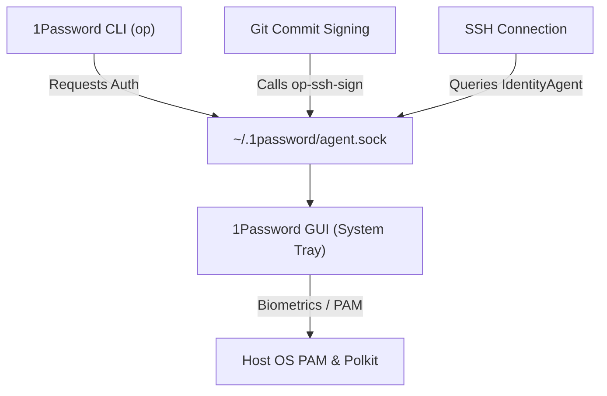

# My Personal Nix Configuration: Discoveries and Learnings

In [The Holy Grail of Development Environments](/blog/journey-to-nix/), I shared my transition from clunky Docker containers and massive Bash scripts to project-level Nix shells. In this follow-up, I want to compile the learnings and discoveries from extending Nix to my personal desktop environment using Home Manager.

Rather than just telling you "what I have" in my configuration, this is a structured walkthrough of the practical challenges, design tradeoffs, and technical solutions I discovered while building a personal Nix setup on top of a generic Linux distribution (Ubuntu).

---

## Starting Small: Package Declarations & Boundaries

When transitioning from standard system packages (`apt install`), the first step is declaring your tools in `home.packages` inside your `home.nix`:

```nix
home.packages = [
  pkgs.git
  pkgs.gh
  pkgs.zsh
  pkgs.vscode
  pkgs.docker
  pkgs.nodejs_22
  pkgs.uv
  pkgs.just
];
```

Two critical fundamentals immediately arise here:

1. **The `stateVersion` Boundary**: 
   ```nix
   home.stateVersion = "25.05";
   ```
   This is a common point of confusion for beginners. It does not pin the versions of the packages you install. Instead, it marks the compatibility boundary for Home Manager's internal configuration semantics. Setting it once and leaving it alone prevents updates from introducing breaking changes to your user configuration.
2. **Auditing Unfree Software**:
   ```nix
   nixpkgs.config.allowUnfree = true;
   ```
   Because Nix takes software licenses seriously, proprietary tools like VS Code or the 1Password GUI will fail to build unless you explicitly allow unfree packages. This provides an excellent mechanism to audit exactly which proprietary tools your environment relies on.

---

## Challenge 1: The Generic Linux Desktop Integration (Icons & Launchers)

When you run Home Manager on a generic Linux distribution rather than NixOS, your desktop environment is managed by the host OS (e.g., Ubuntu running GNOME).

### The Discovery
When you install a GUI application (like `freelens-bin` or `_1password-gui`) via Nix, the binary is stored in `/nix/store/...` and its launcher shortcut (`.desktop` file) is symlinked into `~/.nix-profile/share/applications/`. 

Because the host operating system is unaware of Nix store paths, these applications do not show up in the Ubuntu application menu, and their launcher icons are completely missing.

### The Solution
To solve this, you must configure Home Manager to bridge its profile path to the host OS's desktop environment:

```nix
targets.genericLinux.enable = true;
```

This simple flag instructs Home Manager to configure and export the correct XDG environment variables—specifically appending `~/.nix-profile/share` to `XDG_DATA_DIRS`. Once active, the host's desktop environment automatically scans your Nix profile, making your Nix-installed GUI applications visible in the application launcher with their respective icons.

---

## Challenge 2: The Electron Sandbox Conflict

Many modern desktop applications, including VS Code and internal development tools like Antigravity, are built on Electron (which relies on Chromium).

### The Discovery
Chromium uses Linux namespaces to enforce its sandbox model. However, when Electron applications are executed from the read-only Nix store on a generic Linux host, the sandbox initialization conflicts with host-level security profiles and user namespaces. The application will fail to launch, frequently throwing permission or namespace errors in the terminal.

### The Solution
The most stable workaround on generic Linux is disabling the Electron sandbox using the `--no-sandbox` flag. I configured Zsh aliases and the default Git editor configuration to handle this automatically:

```nix
programs.zsh.shellAliases = {
  code = "code --no-sandbox";
  antigravity = "antigravity --no-sandbox";
  antigravity-ide = "antigravity-ide --no-sandbox";
  nix-conf = "code ~/.config/home-manager/home.nix";
};

programs.git.settings.core.editor = "code --wait --no-sandbox";
```

The `--wait` flag in the Git configuration tells the terminal to block until you close the VS Code editor tab, ensuring Git commit messages can be written seamlessly.

---

## Challenge 3: Wiring 1Password Biometrics on Generic Linux

Integrating 1Password to sign Git commits and manage SSH keys is a massive quality-of-life improvement. However, 1Password consists of two components that must communicate: the **CLI** (`op`) and the **GUI** desktop application.



### The SUID and Polkit Challenge
For the 1Password GUI to perform system authentication (like triggering a fingerprint reader or password prompt), it requires:
1. A root-owned **SUID helper binary** (`1password-helper` or `op-helper`) to verify calling processes.
2. A **Polkit action policy** (`com.1password.1Password.policy`) installed in the system directory.
3. A **PAM configuration** file placed in `/etc/pam.d/`.

Because Home Manager runs strictly in user space, it cannot set the SUID bit on Nix store files or write to host-level directories like `/etc/`. If you install `_1password-gui` purely through Home Manager, biometric unlock and CLI integration will fail out of the box.

### The Solutions
To resolve this on generic Linux, you have two primary options:

#### Option A: The Hybrid Approach (Recommended)
Install the 1Password GUI natively using the host package manager (`apt` on Ubuntu). This lets the OS handle SUID wrappers, PAM, and Polkit policies cleanly. 

Then, use Home Manager to manage the CLI configurations, SSH agent socket, and Git signing:

```nix
# Configure SSH to target the 1Password agent socket
programs.ssh = {
  enable = true;
  enableDefaultConfig = false;
  extraConfig = ''
    Host *
      IdentityAgent ~/.1password/agent.sock
  '';
};

# Configure Git commit signing via the 1Password helper
programs.git.settings = {
  gpg.format = "ssh";
  "gpg \"ssh\"".program = "${lib.getExe' pkgs._1password-gui "op-ssh-sign"}";
  commit.gpgsign = true;
  user.signingKey = "ssh-ed25519 AAAAC3NzaC1lZDI1NTE5AAAAIOEoWpD34ilaJ8Br9XpkNTwuJuIYBFOTrlEWyQMrXT+6";
};
```

Even with the GUI installed natively, using `${lib.getExe' pkgs._1password-gui "op-ssh-sign"}` dynamically resolves the helper binary path from the Nix package without hardcoding hashes.

#### Option B: The Pure Nix Manual Setup
If you prefer keeping the GUI package inside your Nix configuration, you must manually perform the host system integration:
1. Symlink the Polkit policy from your Nix profile to the host system:
   ```bash
   sudo ln -sf ~/.nix-profile/share/polkit-1/actions/com.1password.1Password.policy /usr/share/polkit-1/actions/
   ```
2. Enable fingerprint/system authentication on the host:
   ```bash
   sudo pam-auth-update
   ```
3. Symlink the Nix-installed `op` binary to `/usr/local/bin` so the 1Password GUI can verify it at a trusted path:
   ```bash
   sudo ln -sf ~/.nix-profile/bin/op /usr/local/bin/op
   ```

---

## Transitioning to Flakes for Configuration Management

While you can manage Home Manager using a standalone `home.nix` file, wrapping your user configurations in a `flake.nix` inside `~/.config/home-manager/` adds immense value.

Here is how my `flake.nix` is structured:

```nix
{
  description = "Home Manager configuration";

  inputs = {
    nixpkgs.url = "github:nixos/nixpkgs/nixos-unstable";
    home-manager = {
      url = "github:nix-community/home-manager";
      inputs.nixpkgs.follows = "nixpkgs";
    };
    antigravity = {
      url = "github:jacopone/antigravity-nix";
    };
  };

  outputs = { self, nixpkgs, home-manager, antigravity, ... }@inputs:
    let
      mkHome = { username, system ? "x86_64-linux" }:
        let
          pkgs = nixpkgs.legacyPackages.${system};
        in home-manager.lib.homeManagerConfiguration {
          inherit pkgs;

          modules = [
            ./home.nix
            {
              home.username = username;
              home.homeDirectory = "/home/${username}";
            }
          ];
          
          extraSpecialArgs = {
            antigravity-nix = antigravity.packages.${system};
          };
        };
    in {
      homeConfigurations = {
        "xnok" = mkHome { username = "xnok"; };
      };
    };
}
```

### Key Advantages of the Flake Wrapper
- **`flake.lock`**: Locks all inputs (like `nixpkgs` and `home-manager` branches) to specific Git commits. This guarantees that running `home-manager switch` builds the exact same environment every time.
- **`extraSpecialArgs`**: Allows passing custom variables down to your modules. I use this to inject packages from my custom `antigravity-nix` overlay directly into my `home.nix` module parameters:
   ```nix
   { config, pkgs, lib, antigravity-nix ? null, ... }: {
     home.packages = [
       # ...
       antigravity-nix.google-antigravity-no-fhs
       antigravity-nix.google-antigravity-ide-no-fhs
     ];
   }
   ```

---

## Everyday Needs: Stretching to Everything

Once your personal configuration is managed declaratively, it is easy to slowly expand it to cover daily workflows:

- **Auto-Starting Services**: Rather than configuring host-specific startup applications, you can manage them as Systemd user services directly in your home configuration:
  ```nix
  systemd.user.services.onepassword = {
    Unit = {
      Description = "1Password GUI";
      After = [ "graphical-session.target" ];
    };
    Service = {
      ExecStart = "${pkgs._1password-gui}/bin/1password";
      Restart = "always";
    };
    Install = {
      WantedBy = [ "graphical-session.target" ];
    };
  };
  ```
- **Instant IDE Integrations**: By enabling `direnv` and `nix-direnv` in Home Manager, any project folder with a `.envrc` file containing `use flake` automatically loads your tools and environments the moment you open a terminal in VS Code.

---

## Conclusion

Transitioning a personal machine to Home Manager on generic Linux is an iterative journey. You start small by replacing `apt` packages with Nix declarations. Over time, you resolve desktop integration challenges, map sandbox configurations, and wire up biometric agents. 

By wrapping it all in a Nix Flake, your entire user environment becomes an immutable, versioned code repository. Whenever you reinstall your system or set up a new machine, a single `home-manager switch` command returns your environment exactly to the state you left it.

---

## Relevant Resources
- **[`my-home-manager` GitHub Repo](https://github.com/xNok/my-home-manager)**: The source for this configuration.
- **[Home Manager Option Search](https://home-manager-options.extranix.com/)**: Discover configuration options.
- **[The Journey to Nix](/blog/journey-to-nix/)**: The background story on why I adopted Nix.
