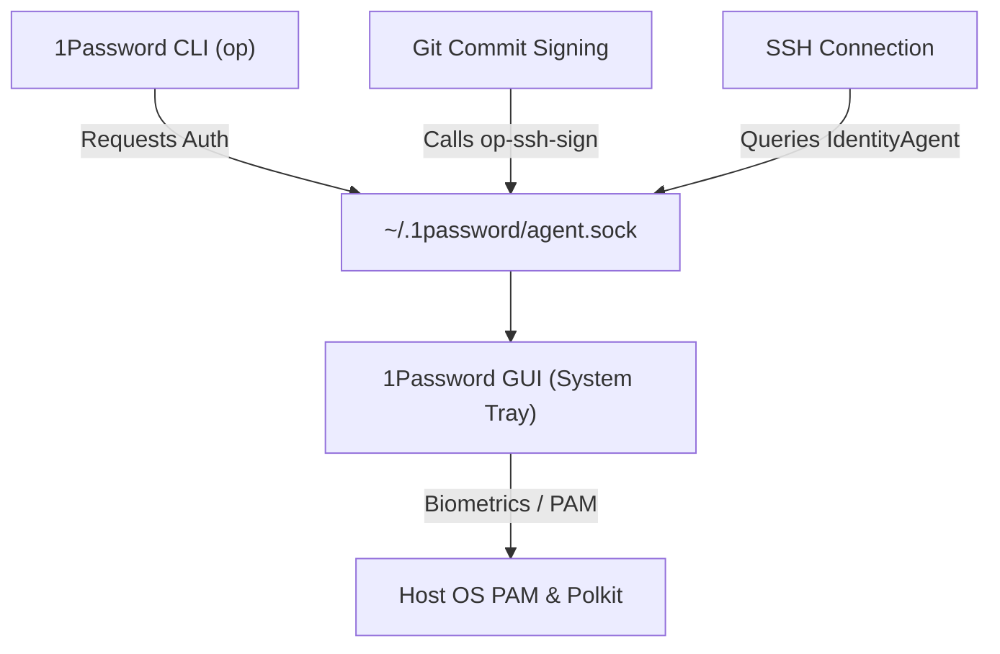

# My Personal Nix Configuration: Discoveries and Learnings

In [The Holy Grail of Development Environments](/blog/journey-to-nix/), I talked about my transition to quest for the perfect development environment which roughly goes allong those lines:
1. **The Docker Era**: Containerizing CLI tools - worked fine but really not ideal when working with local filesytem, simply akward to use after the fact.
2. **The Bash Era (`ibt`)**: Custom scripts dispatching host setup - that again worked just fine and served for my gitpod setups and local env, but why did i try to write my own package manager wrapper !!!.
3. **The Nix Discovery (`shell.nix`)**: Declaring robust, local project environments - This was the true start. That quickly spreaded to my github Codespace setup and soon Github actions.
4. **Going Deep with `home-manager`**: Codifying my global user profile and desktop settings - why not go all the way? plus now that i ask gemini to write nix configs its a piece of cake 😉, and just review after the fact (it least i have a trace of what got installed and can revert back if needed 😉).

But here is the catch: when I wrote about my `home-manager` adoption in that previous article, it read like a smooth, effortless victory. **What I omitted were the "downs"**—the hours spent debugging directory permissions, tracing Nix store symlinks, troubleshooting Chromium sandboxes, and pairing with AI to figure out why my Ubuntu desktop environment refused to load my Nix-installed apps or accept biometrics. 

Running Home Manager on top of a generic Linux host (Ubuntu) instead of a pure NixOS system means you are straddling two different worlds. Rather than just showing a finished config, this follow-up is the real, unvarnished story of those hurdles, the debugging loops, and the exact solutions that resolved them.

Let's dig in.
---

## Starting Small: Package Declarations & Boundaries

When transitioning from standard system packages (`apt install`), the first step is declaring tools in `home.packages` inside your `home.nix`:

```nix
home.packages = [
  pkgs.git
  pkgs.gh
  pkgs.zsh
  pkgs.vscode
  pkgs.docker
  pkgs.nodejs_22
  pkgs.uv
  pkgs.just
];
```

That work fine and I highly recommend it for CLI tool, ditch your brew install and the like. It gives a solid foundation and the only thing you have to worry about is the scope of those tools.

### The Boundary: Global vs. Project-Level Packages

A core design decision when adopting Nix is deciding what lives in your global `home-manager` profile versus what belongs in project-level `shell.nix` or `flake.nix` configurations managed by `direnv`. 

A quick recap here, direnv is a utility that lets you boostrap you environement when you enter a directory. Typically when doing cd or openning VS code. In our case we want to have then right tools eg python, golang, nodejs version picked up and available in our IDE or terminal. So direnv + nix shell is a perfect match.

The obvious globals are tools like `git`, `gh` CLI, `zsh`, and the `docker` are fundamental, i would sure there from anywhere in any projects, so they should be available in my global profile.  

Then there are the not so obvioud like just or uv, i do yse them a lot and consitently across my projets, so i decided to have them in my global profile too. It just makes sense to have them available everywhere, but that's probably debatable 😉. 


After that everything else can be defined at the project level using direnv and nix shell, I thing a better way to think about it is will my project run in Github Codespaces or Github Actions if so i should define it at the project level. This is not exact science but it gives us a goood rule of thumb.


### Finding the Right Nix Packages  

One challenge I faced is finding the exact package names in `nixpkgs`—the naming conventions are not always obvious. For example, the 1Password GUI package is named `_1password-gui` (with a leading underscore), and specific versions of programming languages carry suffix tags (like `nodejs_22` or `python311`).

The first thing to look for are home-manager modules, those are prepacked modules that home-manager can use to configure packages, you can find a list of them in the [home-manager website](https://nix-community.github.io/home-manager/options.html). Those are opinionated home-manager module wrapper that go beyond the installation and for instance can managed the tools configuration, add it to your path or auto-register services to systemd. Alway look for a module first `programs.x` and then a package `pkgs.x`. You can of course create your own modules but that's for another day. 

With home-manager  you can install pretty much any nixpkgs package, but the package name might not be obvious. So beyound that to discover packages and their options, you have two main tools:
1. **The Web Search**: The official [NixOS Package Search](https://search.nixos.org/packages) is the easiest way to search packages, view options, and check which channels contain a given version. 
2. **The CLI Search**: If you are in the terminal and need to search, you can run:
   ```bash
   nix search nixpkgs <query>`
   ```

> [!NOTE]
> **Docker Client Boundary**: Installing `pkgs.docker` only provides the Docker CLI. The Docker daemon must still be installed on the host OS (e.g., via `apt` or Docker Desktop) and your user must be added to the host's `docker` group.
>
> **Declaring VS Code**: While declaring `pkgs.vscode` directly works, Home Manager also offers a rich, dedicated `programs.vscode` module to manage settings, keybindings, and extensions (like `programs.vscode.extensions`) declaratively in the future.


### Under the Hood: What Makes Nix Different?

Good so far things are not looking too ugly so before we go further let's dig a bit into what makes Nix different from traditional package managers and by extension why home-manager is different. Unlike traditional package managers (like `apt` or `brew`) that unpack files directly into system folders like `/usr/bin/` or `/usr/local/bin/`, Nix isolates everything:

* **Download binary into the read-only Nix Store**: Every package is built and stored in its own unique, hash-addressed directory under `/nix/store/` (e.g., `/nix/store/h3p9...-git-2.43.0/`). This prevents different programs from sharing or overwriting each other's shared libraries (`.so` or `.dll` files), completely eliminating dependency hell.
* **Symlinked User Profiles**: Since your host OS and shell do not look at `/nix/store/` directly, Home Manager creates a set of symlinks inside your home directory. All binaries are symlinked into `~/.nix-profile/bin/`, and configurations are symlinked into standard directories like `~/.config/`.
* **Zero System Contamination**: If you remove a package, Home Manager simply deletes the user-space symlink. Running `nix-collect-garbage` cleans up the actual binary from `/nix/store/`, leaving your host operating system completely untouched.

This what allow you to rollback to previous configurations or switch between different configurations with ease, without breaking your system. pretty powerful stuff! who doesn't like to experiment with new tools but keep a clean system at the same time?

Now that we have the basis and the theory let's dig into some issues.

## Challenge 1: The Generic Linux Desktop Integration (Icons & Launchers)

When you run Home Manager on a generic Linux distribution rather than NixOS, your desktop environment is managed by the host OS (e.g., Ubuntu running GNOME) and this comes with the frustration that when you install a GUI application (like `freelens-bin` or `_1password-gui`) via Nix, you expect to find a laucher icon for it in your application menu but nothing shows up and if you lauch the application via the terminal you get the very ugly default script icon.

The issue occurs because when you install a GUI application, its binary is stored in `/nix/store/...` and its launcher shortcut (`.desktop` file) is symlinked into `~/.nix-profile/share/applications/`. Since the host operating system is completely unaware of Nix store or profile paths, it never indexes them, leaving your newly installed apps invisible and icon-less in your desktop launcher.

To solve this, you must instruct Home Manager to bridge its profile path to the host OS's desktop environment by enabling these options in your configuration:

```nix
targets.genericLinux.enable = true;
xdg.enable = true;
```

These flags configure and export the correct XDG environment variables—specifically appending your user's Nix profile paths (like `~/.nix-profile/share`) to `XDG_DATA_DIRS`.

That's kind of a non-sense I would have expected home-manager to do this by default!


## Challenge 2: The Electron Sandbox hell

Many modern desktop applications, including VS Code and Antigravity, are built on Electron (which relies on Chromium). When running these applications through Nix on a generic Linux host, they will frequently fail to launch, crashing with permission or user namespace errors in the terminal.

To understand why this happens, we have to look under the hood of Chromium's multi-process security model. Chromium uses two methods to isolate untrusted web and application processes:

1. **The SUID Sandbox**: A root-owned helper binary (`chrome-sandbox`) that configures isolation.
2. **Unprivileged User Namespaces**: A feature of the Linux kernel (`CLONE_NEWUSER`) that allows unprivileged processes to create isolated namespaces — similar to how Docker operates.

When running on a generic Linux host, both of these methods fail out of the box with Nix:
* **The SUID Sandbox is blocked**: Nix builds all packages as unprivileged store-builders and mounts the `/nix/store/` as read-only. Consequently, Nix cannot set the SUID bit on the `chrome-sandbox` helper binary.
* **User Namespaces are restricted**: Because SUID fails, Chromium falls back to using unprivileged user namespaces. However, modern Linux distributions restrict unprivileged user namespaces by default via AppArmor to reduce the local kernel privilege escalation attack surface.

Debugging this took considerable research and a lot of tokens to evaluate different solutions. 

#### Workaround: The `--no-sandbox` Flag (Easiest but feels wrong)

Disabling the sandbox entirely by passing the `--no-sandbox` flag to Electron bypasses the namespace checks. I configured my Zsh configurations to handle this:

```nix
programs.zsh.shellAliases = {
  code = "code --no-sandbox";
  antigravity = "antigravity --no-sandbox";
  antigravity-ide = "antigravity-ide --no-sandbox";
  nix-conf = "code ~/.config/home-manager/home.nix";
};

programs.git.settings.core.editor = "code --wait --no-sandbox";
```

Disabling the sandbox maybe acceptable, but why would this be the default behaviour? should we really walk arround the inplace security just because we want to use Nix? This is what most AI kept suggestiong until i forced them to drive me into the world of linux kernel security features. Another bad idea the AI got was to diable apparmor!


### The Safer, Permanent Solution: A Targeted Host AppArmor Profile`

Instead of compromising security or disabling host protection globally, the cleanest approach is configuring a targeted AppArmor profile **on the host OS**. Of course this configuration must be done outside of Home Manager since it requires root access.

We can create an AppArmor profile that specifically allows unprivileged user namespaces *only* for binaries executed from the Nix store.

1. Create a file on the host at `/etc/apparmor.d/nix-packages`:
   ```text
   abi <abi/4.0>,
   include <tunables/global>

   # Create a profile that matches all binaries executed from the Nix store
   profile nix-store-binaries /nix/store/** flags=(unconfined) {
       # Specifically allow these processes to use user namespaces
       userns,
   }
   ```
2. Reload AppArmor to apply the profile:
   ```bash
   sudo service apparmor reload
   ```

By doing this, AppArmor permits Electron apps running from `/nix/store/` to instantiate their user namespaces. This allows Electron to launch with its sandbox fully enabled, keeping your workspace secure without disabling your host operating system's overall protections. I think we could make the profile a little bit more specific by listing the app that can do that specifically, but this felt good enought for me.

---

## Challenge 3: Wiring 1Password Biometrics on Generic Linux

Integrating 1Password to sign Git commits and manage SSH keys is a massive quality-of-life improvement. However, 1Password consists of two components that must communicate: the **CLI** (`op`) and the **GUI** desktop application.



I opted for a **pure Nix setup**, managing both the CLI and the GUI application directly through Home Manager. Doing this was an intresting learning experience—it forced me to understand exactly how security policies are managed, how fingerprinting works, and how applications gain access to biometric hardware.

For the 1Password GUI to perform system authentication (like triggering a fingerprint reader or password prompt), it requires three system-level components:
1. A root-owned **SUID helper binary** (`1password-helper` or `op-helper`) to verify calling processes.
2. A **Polkit action policy** (`com.1password.1Password.policy`) installed in the system directory to authorize biometric prompts.
3. A **PAM configuration** file placed in `/etc/pam.d/`.

Because Home Manager runs strictly in user space, it cannot set the SUID bit on files in the Nix store, nor can it write files to root-level host directories like `/usr/share/polkit-1/actions/` or `/etc/pam.d/`. 

To get fingerprint unlocking and SSH agent socket communication working in this pure Nix setup, I had to manually bridge the gap between user space and system space on the host OS:

1. **Link the Polkit Policy**: Symlink the Polkit policy from the Nix profile to the host system so the Polkit daemon knows about it:
   ```bash
   sudo ln -sf ~/.nix-profile/share/polkit-1/actions/com.1password.1Password.policy /usr/share/polkit-1/actions/
   ```
2. **Enable PAM Fingerprinting**: Enable fingerprint/system authentication on the host Ubuntu system:
   ```bash
   sudo pam-auth-update
   ```
3. **Configure SSH and Git**: In Home Manager, configure the SSH agent and Git signing helper to communicate with the user-space socket at `~/.1password/agent.sock`:
   ```nix
   programs.ssh = {
     enable = true;
     enableDefaultConfig = false;
     extraConfig = ''
       Host *
         IdentityAgent ~/.1password/agent.sock
     '';
   };

   programs.git.settings = {
     gpg.format = "ssh";
     "gpg \"ssh\"".program = "${lib.getExe' pkgs._1password-gui "op-ssh-sign"}";
     commit.gpgsign = true;
     user.signingKey = "ssh-ed25519 AAAA...";
   };
   ```

---

While SSH agent forwarding and Git commit signing work flawlessly, I hit one frustrating, unresolved hurdle: **the `op` CLI is unable to communicate with the desktop GUI app socket**, meaning that running commands in the terminal (like `op item get`) fails to trigger the biometric fingerprint prompt.


## Transitioning to Flakes: The Game Changer for Dotfiles

If you start researching Home Manager, most tutorials will guide you to manage it using a standalone, global `home.nix` file. While that works to get you started, it quickly introduces a classic Nix problem: **brittleness**. 

Without Flakes, your configuration relies on Nix channels (`nix-channel`). This means your packages are pulled from whatever state your local channels happen to be in when you run an update. If you build your configuration on Tuesday, and runs the exact same config on Friday, you can easily end up with different package versions. Playing version roulette with your system configurations is the exact opposite of what we want when aiming for declarative reproducibility.

Nix Flakes were introduced to solve this. They bring modern packaging principles (like `package-json` and `package-lock.json` from the Node ecosystem) directly to the system configuration layer.

### Anatomy of My `flake.nix`

I decided to wrap my entire Home Manager setup inside a Nix Flake located at `~/.config/home-manager/`. The `flake.nix` file serves as an entrypoint that defines my dependencies (inputs) and my configurations (outputs).

```nix
{
  description = "Home Manager configuration";

  inputs = {
    nixpkgs.url = "github:nixos/nixpkgs/nixos-unstable";
    home-manager = {
      url = "github:nix-community/home-manager";
      inputs.nixpkgs.follows = "nixpkgs";
    };
    antigravity = {
      url = "github:jacopone/antigravity-nix";
    };
  };

  outputs = { self, nixpkgs, home-manager, antigravity, ... }@inputs:
    let
      mkHome = { username, system ? "x86_64-linux" }:
        let
          pkgs = nixpkgs.legacyPackages.${system};
        in home-manager.lib.homeManagerConfiguration {
          inherit pkgs;

          modules = [
            ./home.nix
            {
              home.username = username;
              home.homeDirectory = "/home/${username}";
            }
          ];
          
          extraSpecialArgs = {
            antigravity-nix = antigravity.packages.${system};
          };
        };
    in {
      homeConfigurations = {
        "xnok" = mkHome { username = "xnok"; };
      };
    };
}
```

Adding this flake wrapper unlocked several critical capabilities for my setup:

1. **The Almighty `flake.lock`**: The moment you build a flake, Nix generates a lockfile pinning every input (like the `nix-community/home-manager` repository and the `nixos/nixpkgs` branch) to a specific, immutable git commit hash. This guarantees 100% reproducibility. Whether I rebuild my system tomorrow, next month, or on a brand new laptop, the build will output the exact same binary configurations.

2. **Declaring Custom Inputs with `extraSpecialArgs`**: This is where things get really interesting. I have internal tools and environments for instance a custom `antigravity-nix` overlay. With flakes, I can declare `antigravity` as an input and pass its evaluated package set directly down to my `home.nix` module using `extraSpecialArgs`.
   
   This allows me to keep my custom tools isolated and modular. In `home.nix`, I can pull these custom packages directly from the module arguments without polluting global paths:
   ```nix
   { config, pkgs, lib, antigravity-nix ? null, ... }: {
     home.packages = [
       # Core standard packages...
       
       # Custom development tools passed in via flake outputs:
       antigravity-nix.google-antigravity-no-fhs
       antigravity-nix.google-antigravity-ide-no-fhs
     ];
   }
   ```

Wrapping your Home Manager configuration is just scratching the surface of what Nix Flakes can do. Once you adopt flakes, you unlock a unified standard across the entire Nix ecosystem:

* **Declarative Operating Systems (NixOS)**: You can manage your entire machine's hardware, drivers, file systems, systemd services, and user accounts in a single repository.
* **Instant Project Development Shells (`nix develop`)**: As shown in my [Journey to Nix](/blog/journey-to-nix/), flakes let you declare project dependencies inside a repository. Other developers can run `nix develop` and instantly drop into an environment with the correct compilers, runtimes, and databases without installing anything on their host system.
* **Universal Application Running (`nix run`)**: Any software packaged with a flake can be executed directly from git. For example, running `nix run github:xNok/some-tool` fetches, builds, and executes the tool in an isolated sandbox without globally installing it.
* **Reusable Templates**: You can use flakes to bootstrap new projects. Running `nix flake new -t github:nixos/templates#rust` instantly scaffolds a reproducible Rust project ready for development.

-The downside is that it feels you are writting more code while the original `home-manager` was just a matter of adding packages and editing the `home.nix` file. I guess once you have played enought with a tool you don't mind learning the extra mile it can take you. It's a trade-off I am happy to take out of curiosity but then i can't say my configuration is simple, it is not just a declarative config.

## Improving the everyday desktop experience

Once your personal configuration is managed declaratively, i feelt like i was missing something usually apps like 1password auto start after you login. Luckily this is a behaviour we can get back, usually an installer will register the application as a service on the system no just a binary for the current user. We can use home manager to create the same service for our user.

For example you can manage 1password as a Systemd user service directly in your home configuration:

```nix
systemd.user.services.onepassword = {
  Unit = {
    Description = "1Password GUI";
    After = [ "graphical-session.target" ];
  };
  Service = {
    ExecStart = "${pkgs._1password-gui}/bin/1password";
    Restart = "always";
  };
  Install = {
    WantedBy = [ "graphical-session.target" ];
  };
};
```

I thing this is a nice compromise between simplicity and power. I do not need to mess with systemd config even this is managed as code now.

## Conclusion: Key Takeaways & The Reality of Home Manager


1. **Simple Tooling is a Breeze**: Standard CLI utilities, shells, and single-binary tools work flawlessly out of the box in Home Manager.
2. **Desktop Apps are Hard**: Trying to install *every* single application via Nix is not easy. Complex GUI applications or software with multi-component architectures (like 1Password's GUI and CLI separation, or Electron apps that need custom sandboxing) do not fit neatly into Nix's read-only user-space paradigm.
3. **Getting into the Host Security Weeds**: Managing these desktop tools on a generic Linux distro (like Ubuntu) forces you to get deep into the details of the host OS's security stack. To make them work, you must learn to navigate:
   * **AppArmor**: Restricting or allowing unprivileged user namespaces for Electron apps.
   * **PAM and Polkit**: Authorizing biometrics and fingerprint sensors from a user-space Nix package.
   * **SUID and SGID**: Understanding how the OS checks process credentials and group ownerships for sockets.

Ultimately, while you will hit hurdles when packaging desktop applications, the benefits of keeping your system tidy is worth the effort. If you got time for it of course it forces you to learn how your Linux system behaves under the hood—making you not just a better Nix user, but a more knowledgeable Linux administrator.

I would recommend nix shell and flake to anyone it really a good solution to manage project tools, couple this with direnv it is just magic. The move to home-manager after the fact is more a nerd move, it seems great on paper but in reality it is a bit of a hassle and have to do changes outside of home-manager config for thing to work properly it kinda defeats the purpose of having it if you have to do workarounds anyway.

---

## Relevant Resources
- **[`my-home-manager` GitHub Repo](https://github.com/xNok/my-home-manager)**: The source for this configuration.
- **[Home Manager Option Search](https://home-manager-options.extranix.com/)**: Discover configuration options.
- **[The Journey to Nix](/blog/journey-to-nix/)**: The background story on why I adopted Nix.
