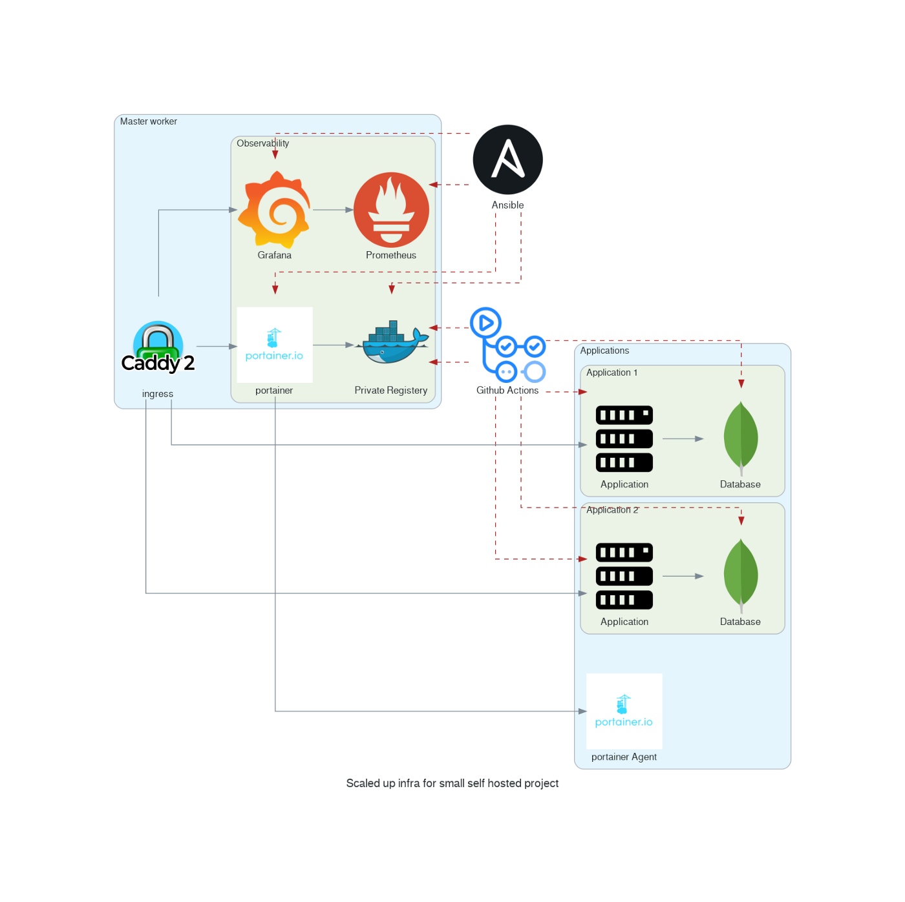

Experimenting with Docker Swarm and having only a single node is a bit sad 😞. Luckily in my previous tutorial, you learn how to create [**A Disposable Local Test Environment using Vagrant and Ansible**](https://faun.pub/a-disposable-local-test-environment-is-essential-for-devops-sysadmin-af97fa8f3db0)**. **If you followed along you know a little bit more about Vagrant and Ansible** but nothing worth showing off **🤯**, **so let up our game and create a multi-VM Docker Swarm cluster.
This involves using **Vagrant **to create multiple VM, then using **Ansible **to install docker on each machine, before creating a Docker Swarm cluster with all our nodes. On this is in place you have a solid foundation to experiment with Docker

Photo by [Ben White](https://unsplash.com/@benwhitephotography?utm_source=medium&utm_medium=referral) on [Unsplash](https://unsplash.com/?utm_source=medium&utm_medium=referral)
I want to remind you that the goal of this tutorial series is to document what I consider the bare minimum for a small self-hosted side project. I invite you to visit my repository for more information: [https://github.com/xNok/infra-bootstrap-tools](https://github.com/xNok/infra-bootstrap-tools). At this point, we are doing the groundwork of setting up a server to host the application we will deploy later as docker containers.

# Provisioning Multiple VMs with Vagrant
Like in the previous tutorial we use Vagrant to create virtual machines. The difference is that this time we are provisioning 3 VMs so the file became sensibly bigger. I will explain the content of this file in the next section.
Here is the new updated `Vagrantfile` . Before running `vagrant up` there are two more things you need to set up: `ansible.cfg` and `inventory` The code will be below this big `Vagrantfile` .
So the two last things you need 😅. Create an `ansible.cfg` file, we are fine-tuning ansible configuration to work with our setup. You won’t have an interactive shell so we won’t be able to accept SSH fingerprints. This configuration will also be essential to have ansible your working in your CI/CD since we are facing the same constraint.

```text
[ssh_connection]
ssh_args = -o ControlMaster=auto -o ControlPersist=60s -o UserKnownHostsFile=/dev/null -o IdentitiesOnly=yes

```

Last we need to manually define the inventory file. Since we selected the IPs in the private network this is a simple task. Not that we also take advantage of our `synced_folder` to obtain the SSH keys required for ansible to connect to `node1` and `node2` .

```text
node1      ansible_host=172.17.177.21 ansible_ssh_private_key_file=/vagrant/.vagrant/machines/node1/virtualbox/private_key
node2      ansible_host=172.17.177.22 ansible_ssh_private_key_file=/vagrant/.vagrant/machines/node2/virtualbox/private_key
controller ansible_host=172.17.177.11 ansible_connection=local[nodes]
node[1:2][managers]
controller

```

Now you can provision the infra with Vagrant

```text
Vagrant up

```

# Focus on the Vagrantfile
First, we select the Vagrant box we use as a base. This time I use ubuntu instead (`generic/ubuntu2004` ) I found it easier for installing the latest version of Ansible on the controller. Notice that I added `virtualbox` specific configurations. Since you are running multiples VMs it is important to control the size of each VM as to not starve your PC resources. Also, I used the `linked_clone` option to speed up the process, that way VirtualBox will create a `base` VM (that will stay turned off) and clone this VM to create the other three.
Next, we have the two worker node definition. This step is straightforward. What is new here is that we set fix IPs to our VM, this makes it easier to create a static Ansible inventory.
Before starting with the controller I want you to look at the Vagrant documentation and notice that there is two Ansible provider **`ansible`**** and ****`ansible_local`**** . **I used the second one so I don't have to bother** installing ansible** and I find that this approach is closer to the CI/CD approach you will use later in the series. As a result, to create two nodes we will provision three machines one of which is the controller and has the responsibility of running ansible and provisioning the other machines.
First, we create two `synced_folder` to give the VM access to our playbook and roles. That way we can update any Ansible code and use it immediately in the VM. Note that to avoid permission issues I forced the `uid` and `guid` as well as restricting files read/write access to the user only. The reason is that Ansible uses SSH keys stored in this folder (see inventory file) and permission for those keys needs to be that way.
The more complicated part comes in the `provision` section. I want to use the latest 2.x version of ansible to use the latest version of `docker_swarm` and `docker_swarm_info` modules. The issue is that ansible made a lot of structural changes between 2.7 and 2.10. So a little bit of hacking is required to install the desired version. I found this method on Github and it works like a charm.

# Setting up Docker with Ansible
Our playbook is about to become a little bit more complicated on top of that installing docker is something you may want to reuse in several projects. I will assume you are somewhat familiar with Ansible and took the time to play a little bit with the hello-world playbook you used in the first tutorial.
There are multiple ways to create roles with ansibles but I want to keep is as simple as possible. But you should know that the recommended way to create roles is to use `ansible-galaxy init` . See the documentation [here](https://galaxy.ansible.com/docs/contributing/creating_role.html). The downside of this approach is that it creates a folder and files you may not use. Let’s keep things simple and create the minimal structure.
Ansible looks for a folder called `roles` and then a subfolder with the name of that role here `docker` , finally, the first thing Ansible does is to read the `main.yml` from the `meta` folder of that role to get collect metadata information about it.
The `meta/main.yml` only requires you to specify dependencies for this role, meaning other roles that you would expect to execute before this one.

```text
dependencies: []
  # List your role dependencies here, one per line. Be sure to remove the '[]' above,
  # if you add dependencies to this list.

```

Finally, we need to defines so tasks to complete the docker installation. It is a good practice exercise to look at the official docker installation documentation and turn it into an Ansible role: [https://docs.docker.com/install/linux/docker-ce/debian/](https://docs.docker.com/install/linux/docker-ce/debian/). Create the file `/tasks/main.yaml`
Then the content of `main.yml` should look along those lines:
Update your `playbook.yml` file to specify that we want to use this role against all our VMs.
Now it is time to run Vagrant

```text
vagrant up

```

Once the provisioning is completed you should have three VMs with docker setup.

# Setting up Docker Swarm with Ansible
To complete our setup we will need to create three more roles:

- `docker-swarm-controller` will install the required python package on the host running Ansible to controller and manage the swarm. This includes notably the python docker package.
- `docker-swarm-manager` will initialize the swam and join all the targeted nodes as the manager
- `docker-swarm-node` will join all the targeted nodes as workers nodes.
Here is the final Ansible playbook:

# `docker-swarm-controller role`
This role is straightforward I don’t think I need to comment on it.

# `docker-swarm-manager role`
You need to be careful here you can only init a docker swarm once. As a convention, the first node of the group `managers` will be used as the founder of the swarm. Notice that this role uses a variable `swarm_managers_inventory_group_name` . I like my variables to be verbose 😂. We need to read facts about our nodes, this variable tells us what group in the inventory is used for managers
You may be wondering what `hostvars[groups[swarm_managers_inventory_group_name][0]].result.swarm_facts.JoinTokens.Manager` do? When Ansible executed `Init a new swarm with default parameters` we asked Ansible to register some information with `register: result` this is simply the path to collect the information about the join token that the other nodes need to join the swarm as a manager. `Get join-token for manager nodes` effectively persisted the join token on each of the managers as a fact. More about Ansible facts and Variables [here](https://docs.ansible.com/ansible/latest/user_guide/playbooks_vars_facts.html).

# `docker-swarm-node role`
This role is very similar to the previous one except that this time we get the join worker token and register our node as workers.

# Testing that the Docker Swarm is working
Let’s see if everything looks ok in our cluster. SSH to the controller node:

```text
vagrant ssh controller

```

Use the command `docker node ls` to see your cluster

```text
vagrant@ubuntu2004:~$ docker node ls
ID                            HOSTNAME                 STATUS    AVAILABILITY   MANAGER STATUS   ENGINE VERSION
odumha179h5qbtln5jfoql9xc *   ubuntu2004.localdomain   Ready     Active         Leader           20.10.12
opeigd4zdccyzam3yjaakdfzk     ubuntu2004.localdomain   Ready     Active                          20.10.12
yjy282nbmzcr5gx90rvvacla2     ubuntu2004.localdomain   Ready     Active                          20.10.12

```

# Conclusion
Quickly setting up VMs and creating Ansible roles is the fastest way for me to test a simple setup at no cost. This is why Vagrant and Ansible make such a great team to create a **Disposable Local Test Environment**.
As of now, your Docker Swarm is totally empty. In future tutorials let’s create a simple stack you can reuse for almost all your projects. You can check my Github repository [https://github.com/xNok/infra-bootstrap-tools](https://github.com/xNok/infra-bootstrap-tools) to find more tutorials and build the following infrastructure.

Infrastructure for small self-hosted project

# Resolving common problems
Sometimes when provisioning multiple machine issues occur. You should not restart everything from ground zero but use the power of Ansible and Vagrant to resume operation from where the problem occurred.
When the provisioning fails (ansible error) you can restart the provisioning with:

```text
vagrant provision controller

```

It happened to me that an error occurred to a node (SSH errors or node unreachable) in that case reload only the node that creates problems.

```text
vagrant reload node1

```

# References
- [https://github.com/geerlingguy/ansible-role-docker](https://github.com/geerlingguy/ansible-role-docker)
- [https://github.com/ruanbekker/ansible-docker-swarm](https://github.com/ruanbekker/ansible-docker-swarm)
- [https://github.com/atosatto/ansible-dockerswarm](https://github.com/atosatto/ansible-dockerswarm)
- [https://stackoverflow.com/questions/58232506/docker-swarm-module-join-token-parameter-for-ansible-not-working](https://stackoverflow.com/questions/58232506/docker-swarm-module-join-token-parameter-for-ansible-not-working)

