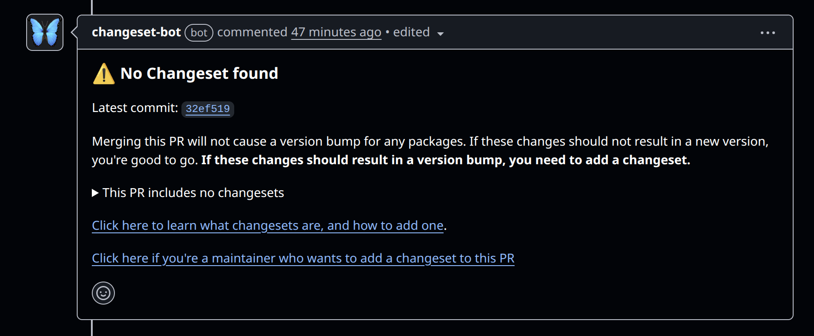
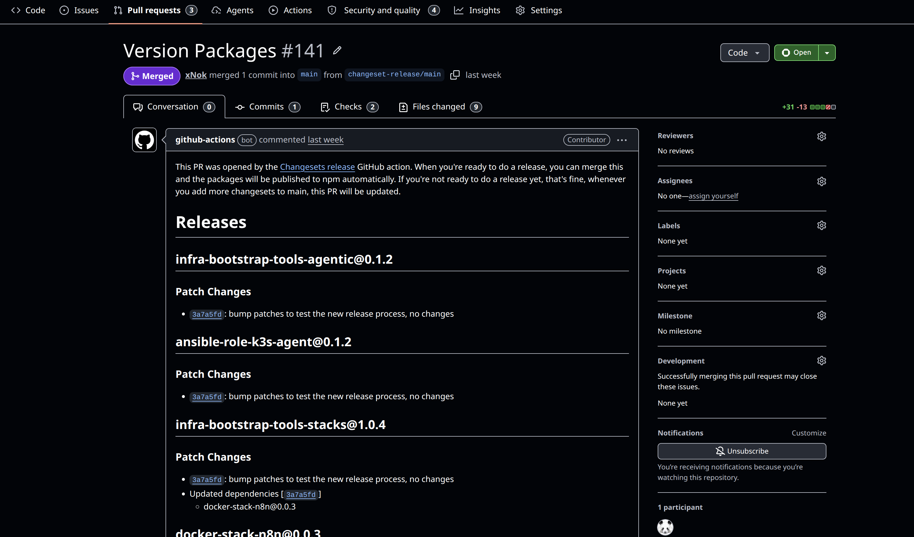
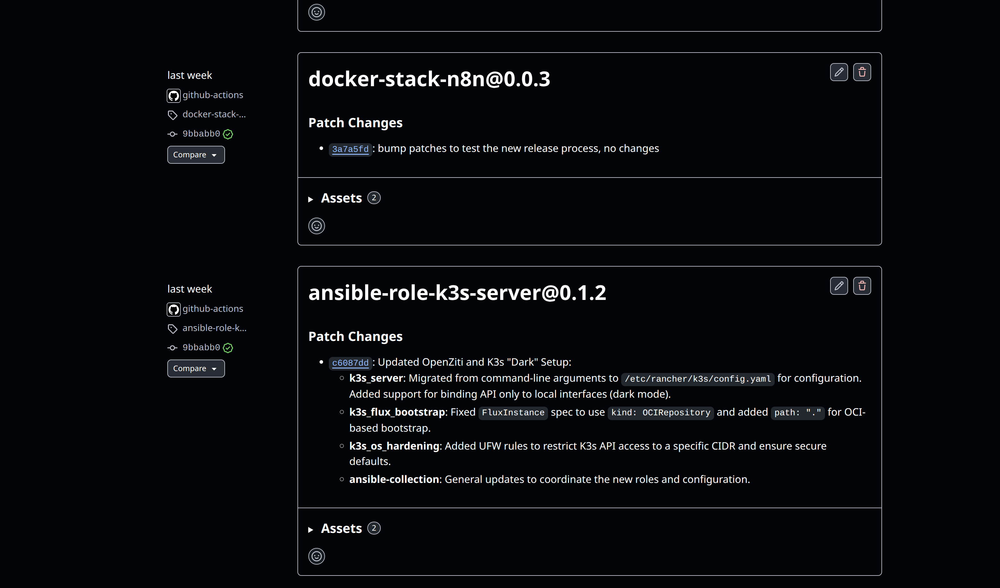

# Intentional Releases: Why I Chose Changesets over Semantic-Release

In the world of DevOps, sometimes maybe I automate a little bit too much. I aim for a smooth and continuous deployment process where I automate builds, testing, deployment, and versioning. The gold standard is probably tools like `semantic-release`—utilities that parse your git history, look for keywords like "feat" or "fix" prefixes, and automatically bump versions and generate changelogs (this is called semantic release by conventional commits).

It sounds perfect, and the promise is genius: make small intentional commits with clear descriptions such that you don't need to waste time writing a changelog later. While the idea is sound, the changelogs produced with this workflow are rarely up to the expectations of the end users.

I more often than not end up with a long list of commit messages that do not convey the essence of a release, just an agglomeration of small changes, leaving me wondering what the point of this release is at all, if anything notable really changes, and if anything really makes this release worth updating to other than doing some due diligence.

Over time, I think I have grown fed up with this standard release notes process and much preferred the teams that took the time to intentionally cut releases rather than aiming for an automated, unemotional release process.

When working on Backstage, I was introduced to Changesets, and I realized that the Node ecosystem, especially those dealing with large monorepos, had felt the need for a better, intentional release process. So I set myself on the quest of integrating Changesets into any monorepos, especially `infra-bootstrap-tools`, which contains absolutely no Node.js code. You will find some Python modules, Ansible Collections, Terraform modules, and Docker Compose configurations—all my experiments that I strived to package and version in a reasonable way, avoiding the automated semantic-release process.

## The semantic-release and conventional commits

Before we get started, it might be worth clearing a common confusion around Semantic versioning and semantic-release.

Semantic versioning is a versioning scheme that is used to version software. It is a way to communicate the changes in a software piece to the users, while `semantic-release` is a Node.js-based CLI tool that generates semantic versions based on the conventional commit specification.

So I can have semantic versioning and "release" said version without conventional commits, but the popular tool `semantic-release` implements the conventional commit specification.

I don't like this naming for the tool (`semantic-release`), because to me, as long as my release is using semantic versioning, it should be a semantic release regardless of whether I use conventional commits or not. But due to the popularity of `semantic-release`, people pretty much unilaterally assume that semantic release means using the conventional commit specification.

Here I am still striving to use semantic versioning, meaning that each version number is composed of a triplet x.y.z where x is the major version, y is the minor version, and z is the patch version. Each of those numbers reflecting the divergence of the codebase from the previous version. For instance:

- x is the major version, and it is incremented when I make breaking changes, meaning this version is not backward compatible with the previous version.
- y is the minor version, and it is incremented when I add new features, but it is backward compatible with the previous version.
- z is the patch version, and it is incremented when I fix bugs, but it is backward compatible with the previous version, and no new features are introduced.

## The Problem with Commit-Based Automation

Commit messages are primarily by developers for developers; after all, I mostly concern myself with commit messages on pull requests and git history. But any code change is often more than the implementation detail of a single change, and a collection of commits can yield a feature more comprehensive and complete than the sum of the changes. Thus, describing a release based on what has changed is definitely not always the best way to communicate the value of a release to the end users.

When you force your release notes to be a direct reflection of your commit history, you run into two major issues:

1.  **The Noise Factor**: A single "feature" might involve five "feat" commits and dozens of "fix" commits. Your changelog becomes a cluttered list of technical steps rather than a summary of value.

2.  **The Intent Gap**: A developer might fix a bug that technically requires a patch bump, but they realize this change actually signals a pivot in how the tool should be used. Commit parsers can't capture that nuance.

While you could technically improve the release description after the release has been cut and a commit has been tagged with a semantic version, it is often not done, and the release notes remain a cluttered list of technical steps rather than a summary of value.

Finally, I am not saying that semantic commits are a bad idea. Actually, I think it is a great thing to ask developers and AI alike to think about the impact of their changes and communicate it clearly, but it should not be the only source of truth for release notes.

## Changesets: Forcing Developer Intent in release process

Changesets takes a different approach. Instead of guessing what should be released based on your commits, it asks you—the developer—to explicitly state your intent.

When you finish a task, you run `npx changeset add`. You are then prompted to:
1.  **Select the affected packages**: In a monorepo like `infra-bootstrap-tools`, this is important because I could have multiple packages that are released together.
2.  **Choose the bump type**: Major, minor, or patch.
3.  **Write the summary**: A human-readable description of the change.

This small markdown file stays in your branch, goes through peer review, and sits in the `.changeset/` folder until you are ready to release.

## Why "Intent" Matters for Your Users

The most powerful part of the Changeset workflow isn't the automation; it's the **pause**. Especially in Pull Requests, I love that the bot is able to comment: *"This PR doesn't have a changeset yet."* Meaning once this PR is complete, please take the time to review the work and come up with a description of what has changed, an intentional artifact of what has changed.

When you write a changeset, you aren't just describing code (technically you should already be done with the implementation), you are communicating with your user base. You are saying: *"I have made this change, I believe it warrants a new version, and here is how it affects you."*

This process forces a level of quality that "automated" commit parsing simply can't match:

- **Migration Guides**: You can explain *how* to upgrade from a breaking change right in the changeset.
- **Value Proposition**: You can explain *why* a new feature is exciting.
- **Explicit Versioning**: You avoid accidental major bumps caused by a mislabeled commit.



## Scaling to a Polyglot Monorepo

Changesets would be a straightforward adoption for Node.js users in a monorepo managed with npm, yarn, pnpm or (any future package manager that would come up), but for other users, using Changesets might not even cross your mind. So let me give you a quick overview of how I use it in my `infra-bootstrap-tools` repository.

In `infra-bootstrap-tools` I manage all my self-hosted POCs and tools in a single monorepo, with a diverse set of technologies:

- **Ansible Collections** (YAML)
- **Python Packages** (Python/Agentic)
- **Docker Stacks** (YAML/Shell)

Changesets allows me to manage these disparate ecosystems with a single, unified workflow. Whether it's my Ansible Galaxy Collection or Terraform module or even some of my recent Python agent experiments, the process is the same. I aim to gather these "intents" throughout the development cycle, and when the time is right, a single "Version Packages" PR merges them all into their respective `CHANGELOG.md` files and creates the release tags, which subsequently trigger the respective publishing pipelines.

### The Big Picture

Since `infra-bootstrap-tools` is not a standard npm project, I use a slightly adapted Changeset process. I use the Changeset release process *only* for versioning and tagging, leaving the actual publishing up to dedicated Github Actions workflows. 

The key is to define "packages" using **`package.json`** files. Even though many of those projects are not Node.js applications, we need to add a `package.json` to any directory we want Changesets to manage. The root directory also contains a master `package.json` defining the workspaces.

For instance the my Ansible collection is defined as a package like this:

```json
{
    "name": "ansible-collection-infra-bootstrap-tools",
    "private": true, # <-- not published via npm
    "version": "1.0.7",
    "workspaces": [
        "roles/*"
    ],
    "dependencies": {
        "ansible-role-docker": "0.0.2",
        "ansible-role-docker-swarm-app-caddy": "0.0.1",
        "ansible-role-docker-swarm-app-portainer": "0.0.1",
        "ansible-role-docker-swarm-controller": "0.0.1",
        "ansible-role-docker-swarm-manager": "0.0.1",
        "ansible-role-docker-swarm-node": "0.0.1",
        "ansible-role-docker-swarm-plugin-rclone": "0.0.1",
        "ansible-role-terraform-aws": "0.0.1",
        "ansible-role-terraform-digitalocean": "0.1.0",
        "ansible-role-utils-affected-roles": "0.0.2",
        "ansible-role-utils-rotate-docker-configs": "0.0.1",
        "ansible-role-utils-rotate-docker-secrets": "0.0.1",
        "ansible-role-utils-ssh-add": "0.0.1",
        "ansible-role-k3s-agent": "0.1.2",
        "ansible-role-k3s-flux-bootstrap": "0.1.0",
        "ansible-role-k3s-os-hardening": "0.1.0",
        "ansible-role-k3s-server": "0.1.2"
    }
}
```

Then each idenividual role has it's own package.json to to also be managed by changesets. In short we use npm package resolution to manage the versions of the different components of the collection.

In short the workflow goes like this:

1. **Dependency Management**: By creating `package.json` files, we can define dependencies event between non-Node modules. For example, an Ansible collection is compose of mutlipel playbook, roles and modules. If anything in the collection is upgraded, Changesets knows that the collection version also needs to be updated. This guarantees that the collecton get's updated while I focus on the individual roles.
2. **Separation of Duties**: Changesets computes the new versions, writes the `CHANGELOG.md` files, and creates Git tags for the releases. It goes no further. 
3. **Dedicated Publish Workflows**: When Changesets pushes those new Git tags to the repository, it triggers downstream GitHub Actions workflows (e.g., `docker-*-publish.yml` or `ansible-publish.yml`) that are listening for tag creation events. These specialized workflows handle grabbing the artifact and publishing it to Docker Hub, PyPI, Ansible Galaxy, etc.


### Deep Dive into the Changeset Workflow (Part 1)

Now let's have a look at exactly the GitHub Actions workflow themselves. We start with `release-changeset.yaml` which runs changeset. This is pretty much what the doc provides with one detail the custom `publish` hook that allows us to define in the root package.json how to publish the changes.

```yaml
name: Changesets Release

on:
  push:
    branches:
      - main

concurrency: ${{ github.workflow }}-${{ github.ref }}

jobs:
  release:
    name: Release
    runs-on: ubuntu-latest
    steps:
      - name: Checkout Repo
        uses: actions/checkout@v4
        with:
          fetch-depth: 0

      - name: Setup Node.js 20
        uses: actions/setup-node@v4
        with:
          node-version: 20
          cache: 'yarn'

      - run: yarn

      - name: Create Release Pull Request or Publish
        id: changesets
        uses: changesets/action@v1
        with:
          publish: yarn release        # <-- this is the key
          createGithubReleases: true   
        env:
          GITHUB_TOKEN: ${{ secrets.GITHUB_TOKEN }}
          NPM_TOKEN: ${{ secrets.NPM_TOKEN }}

```

Whenever the Changesets GitHub Action (`changesets/action@v1`) sees unprocessed `.changeset` markdown files in the `main` branch, it executes a "versioning" step automatically. The action gathers all the new changesets, bumps the versions of the corresponding sub-projects accordingly, updates all the individual `CHANGELOG.md` files, and consumes (deletes) those changesets. Instead of instantly publishing, the CI creates a Pull Request titled **"Version Packages"**.



This Pull Request acts as a final gateway, grouping everything that has been implemented since the previous release. I believe this is really where the Changeset release process shines you could have a pre-release or prodcution checklist to volidate the releaseon tha merge this specific PR to officially cut the release once all the validation passeses. I have envitsion many workflows, for staging/rc release and integration testing hookes to this release workflow to add validation to the release but this is a story for another time.


### Deep Dive into the Publishing Workflow (Part 2)

Rather than scattering `on: push: tags:` across multiple different isolated workflow, I use a **Central Publish Workflow** (`.github/workflows/release.yml`) that acts as a router/dispatcher. 

When Changesets creates a new tag, this single workflow catches it and routes the execution to specialized, reusable workflow templates based on the tag prefix.

```yaml
name: Central Publish Workflow

on:
  push:
    tags:
      - 'v*'
      - '*@*'

jobs:
  publish-agentic:
    if: contains(github.ref_name, 'infra-bootstrap-tools-agentic@')
    uses: ./.github/workflows/release-python.yml
    with:
      release_tag: ${{ github.ref_name }}
      package_dir: 'agentic'
      
  publish-ansible:
    if: startsWith(github.ref_name, 'ansible-collection-infra-bootstrap-tools@')
    uses: ./.github/workflows/release-ansible.yml
    with:
      release_tag: ${{ github.ref_name }}
      collection_dir: 'ansible'

```

This dispatcher pattern allows to have reusable publishing workflows, since the trigger are dispatch they are not tied to a specific repo convention.



Let's look at those reusable workflows, for me on a monorepo it might be over killed but i can totally is that being someing i would use in a multi-repo setup.

For example, to use my Ansible publish template in your own repository, you simply reference the repository and the path to the template:

```yaml
jobs:
  publish:
    # Syntax: org/repo/.github/workflows/filename@ref
    uses: xNok/infra-bootstrap-tools/.github/workflows/release-ansible.yml@main
    with:
      release_tag: ${{ github.ref_name }}
      collection_dir: 'ansible'
    secrets:
      GALAXY_API_KEY: ${{ secrets.GALAXY_API_KEY }}

```

So far i have created three variations:

- **`release-ansible.yml`**: Automates building and publishing Ansible Collections to Ansible Galaxy.
- **`release-python.yml`**: Automates building and publishing Python packages using Poetry and PyPI.
- **`release-stacks.yml`**: Handles releasing infrastructure stacks, aka, docker-compose files.

## Conclusion: Choose Intent over Side-Effects

Automation is great, but automating everything sometime makes those outcome so much less meaningfull, automate bofring repetitive taks bit not those that are meant to communicate with user. When managing release deciding what goes in it and what is relevant for user is not something that a commit history correctly captures, especially when our AI friends join in to commit more and more stuff to the repo. 

Can we please take some time as developer to reflect on what a release contain what use our best judgemennt to "advertice" what it note worthy about it rather than ofloeading it lazily to a tool.
